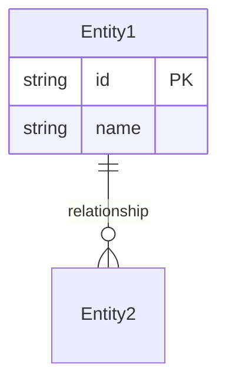

# 仕様書テンプレートスキル

## 目的

このスキルは、仕様書作成時に一貫した構造と品質を確保するためのテンプレートを提供する。

## 適用条件

以下のいずれかに該当する場合、このスキルを適用する:

- `docs/specs/` への新規ファイル作成
- 仕様書、要件定義、機能仕様の作成を求められた
- API仕様、データモデル定義の作成を求められた

## テンプレート選択ガイド

| 目的 | テンプレート | ファイル名規則 |
|------|-------------|---------------|
| 機能要件 | 機能仕様書 | `feat-[機能名].md` |
| API定義 | API仕様書 | `api-[エンドポイント名].md` |
| データ | データモデル仕様 | `data-[エンティティ名].md` |
| UI/UX | UI仕様書 | `ui-[画面名].md` |

## テンプレート: 機能仕様書

```markdown
# 機能仕様書: [機能名]

## メタ情報
| 項目 | 内容 |
|------|------|
| ステータス | Draft / Review / Approved |
| 作成日 | YYYY-MM-DD |
| 更新日 | YYYY-MM-DD |
| 関連ADR | [ADR-XXX](../adr/XXX-*.md) |

## 1. 概要

### 1.1 目的
[この機能が解決する課題、提供する価値]

### 1.2 ユーザーストーリー
```
As a [役割],
I want [機能],
So that [価値].
```

### 1.3 スコープ
**含む:**
- [スコープ内の項目]

**含まない:**
- [スコープ外の項目]

## 2. 機能要求

### FR-001: [要求名]
- **説明**: [要求の詳細]
- **優先度**: Must / Should / Could / Won't
- **受け入れ条件**:
  - [ ] [条件1]
  - [ ] [条件2]

### FR-002: [要求名]
...

## 3. 非機能要求

### NFR-001: パフォーマンス
- [具体的な指標]

### NFR-002: セキュリティ
- [セキュリティ要件]

## 4. データモデル



## 5. インターフェース

### API（該当する場合）
| メソッド | エンドポイント | 説明 |
|---------|---------------|------|
| GET | /api/xxx | 一覧取得 |

### UI（該当する場合）
[画面構成、遷移フロー]

## 6. 制約事項
- [技術的制約]
- [ビジネス制約]

## 7. 依存関係
- [他機能への依存]
- [外部サービスへの依存]

## 8. テスト観点
- [主要なテストケース]
- [エッジケース]

## 9. 未決定事項
- [ ] [要検討項目1]
- [ ] [要検討項目2]

## 10. 変更履歴
| 日付 | 変更者 | 内容 |
|------|--------|------|
| YYYY-MM-DD | | 初版作成 |
```

## テンプレート: API仕様書

```markdown
# API仕様書: [API名]

## メタ情報
| 項目 | 内容 |
|------|------|
| ベースURL | `/api/v1/[resource]` |
| 認証 | Bearer Token / API Key / None |
| 関連仕様 | [feat-*.md](./feat-*.md) |

## エンドポイント一覧

| メソッド | パス | 説明 |
|---------|------|------|
| GET | /resources | リソース一覧取得 |
| POST | /resources | リソース作成 |
| GET | /resources/:id | リソース詳細取得 |
| PUT | /resources/:id | リソース更新 |
| DELETE | /resources/:id | リソース削除 |

## 詳細仕様

### GET /resources

#### リクエスト
**パラメータ:**
| 名前 | 型 | 必須 | 説明 |
|------|-----|------|------|
| page | number | No | ページ番号（デフォルト: 1） |
| limit | number | No | 取得件数（デフォルト: 20） |

#### レスポンス
**成功時 (200):**
```json
{
  "data": [
    {
      "id": "string",
      "name": "string",
      "createdAt": "ISO8601"
    }
  ],
  "pagination": {
    "page": 1,
    "limit": 20,
    "total": 100
  }
}
```

**エラー時 (4xx/5xx):**
```json
{
  "error": {
    "code": "ERROR_CODE",
    "message": "Human readable message"
  }
}
```

## エラーコード一覧
| コード | HTTPステータス | 説明 |
|--------|---------------|------|
| RESOURCE_NOT_FOUND | 404 | リソースが見つからない |
| VALIDATION_ERROR | 400 | バリデーションエラー |
```

## テンプレート: データモデル仕様

```markdown
# データモデル仕様: [エンティティ名]

## 概要
[エンティティの役割と目的]

## ER図

```mermaid
erDiagram
    [Entity] {
        uuid id PK
        string field1
        timestamp created_at
    }
```

## フィールド定義

| フィールド | 型 | 制約 | 説明 |
|-----------|-----|------|------|
| id | UUID | PK, NOT NULL | 一意識別子 |
| field1 | VARCHAR(255) | NOT NULL | [説明] |
| created_at | TIMESTAMP | NOT NULL, DEFAULT NOW() | 作成日時 |

## インデックス
| 名前 | カラム | 種類 | 目的 |
|------|--------|------|------|
| idx_field1 | field1 | BTREE | 検索高速化 |

## 関連
- [関連エンティティへのリンク]
```

## Definition of Ready チェック

仕様書が完成したら、以下を確認する:

```markdown
## Definition of Ready チェックリスト

- [ ] **Doc Exists**: docs/specs/ に仕様書が存在する
- [ ] **Unambiguous**: A〜Dの要素が明記され、解釈の揺れがない
  - [ ] Core Value (Why & Who)
  - [ ] Data Model (What)
  - [ ] Interface (How)
  - [ ] Constraints (Limits)
- [ ] **Atomic**: タスクが1 PR単位に分割されている
- [ ] **Testable**: 受け入れ条件がテストコードで表現可能
- [ ] **Reviewed**: 3 Agents Model でレビュー済み
```

## 参照ドキュメント

- `docs/internal/01_REQUIREMENT_MANAGEMENT.md`
