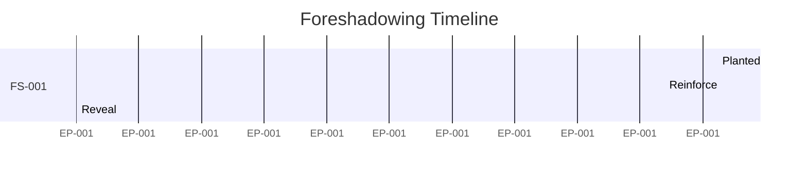

# Review Response: Auto-Novel-Athanor Specs v2

## 1. 総合評価

### 1.1 評価サマリー

| 観点       | 評価 (A-D) | コメント                                                         |
| ---------- | ---------- | ---------------------------------------------------------------- |
| 設計妥当性 | **A**      | 4段階情報制御とChekhov's Gun Trackerの概念統合は非常に合理的。   |
| 実装可能性 | **B**      | エージェント間通信のオーバーヘッドとコンテキスト管理に課題あり。 |
| 網羅性     | **A**      | レビュー依頼の質問も含め、エッジケースまでよく考慮されている。   |
| 保守性     | **B**      | visibility.yamlの管理コストが懸念される。                        |
| **総合**   | **A-**     | **極めて高品質な設計だが、運用負荷への配慮が必要。**             |

### 1.2 一言所感

全体として、Novel-Athanorの「作家性」を損なわずに、NovelWriterの「分析力」と302_novel_writingの「技術」を見事に融合させています。特にAI情報制御の概念は革新的です。ただし、「設定の複雑さ」が作家の執筆フローを阻害しないよう、デフォルト設定や自動化支援（Extract Agent）の精度が鍵になります。

---

## 2. Critical Issues (即座対応必須)

### 2.1 [Prompt Risk in Level 1]

**対象仕様書**: 04_ai-information-control.md (§2.2)
**問題**: Level 1のプロンプト「この秘密について、あなたは内容を知りません。絶対に推測や言及をしないでください」は、**"Pink Elephant Paradox"**（「ピンクの象については考えないで」と言われると考えてしまう現象）を引き起こし、AIによるハルシネーション（勝手な秘密のでっち上げ）を誘発するリスクが高いです。
**影響範囲**: 伏線管理、ストーリーの整合性
**推奨対策**:
逆説的な否定命令ではなく、**「情報の不在」を自然に装うプロンプト**に変更すべきです。
例: `system_prompt_injection: "{character_name}の背景の一部は、現在のコンテキストには含まれていません。提示された情報のみに基づいて描写してください。"`

### 2.2 [Transition Conflict Strategy]

**対象仕様書**: 09_migration.md
**問題**: 新旧システム混在期間中、「`## 隠し設定`」セクションと `visibility.yaml` の両方に定義が存在する場合の優先順位が不明確です。これが競合すると、意図しない情報漏洩が発生します。
**影響範囲**: 移行期間中の執筆安全性
**推奨対策**:
**「より制限の厳しい方を採用する」**(Secure by Default) 原則を明記し、実装すべきです。
`min(hidden_section_level, visibility_yaml_level)` を適用してください。

---

## 3. Major Issues (リリース前対応)

### 3.1 [Agent Simulation Overhead]

**対象仕様書**: 08_agent-design.md (§8.1)
**問題**: YAML形式による厳密なメッセージングプロトコルは、Claude Code環境（シングルコンテキストウィンドウ）においてトークンを浪費する恐れがあります。エージェント間のやり取りをすべてYAMLで出力させると、実質のコンテキストウィンドウが圧迫されます。
**影響範囲**: 生成パフォーマンス、コスト
**推奨対策**:
エージェント間のやり取りは、厳密なYAML通信ではなく、**「Function Calling的なツール連携」**として抽象化すべきです。Continuity Directorの出力をGhost Writerの入力プロンプトに直接注入するパイプライン処理とし、会話履歴としてのメッセージ交換は最小限に留める設計を推奨します。

### 3.2 [Generic Alert Thresholds]

**対象仕様書**: 05_foreshadowing-system.md (§6)
**問題**: 「回収まで5EP前」「未言及10EP」といった閾値がハードコードされています。テンポの早いWeb小説と、重厚なファンタジーでは最適なペースが異なります。
**影響範囲**: ユーザー体験（不要なアラートによる邪魔）
**推奨対策**:
`vault/{作品名}/config.yaml` 等で、作品ごとの**Pacing Profile**を設定可能にしてください。
デフォルト値を「Slow/Medium/Fast」のプリセットで提供すると親切です。

---

## 4. Minor Issues (時間があれば対応)

### 4.1 [Subtlety Level Guidelines]

**対象仕様書**: 05_foreshadowing-system.md
**問題**: `subtlety_level` の定義はありますが、AIがレベルに応じて書き分けるための具体的なプロンプト指針が不足しています。
**推奨対策**:
レベルごとの「形容詞・副詞の制限リスト」や「許可される比喩の抽象度」などのガイドラインを策定し、Writer Agentへ渡す指示書に含める仕組みを追加してください。

---

## 5. Suggestions (検討事項)

### 5.1 [Foreshadowing Dashboard UI]

**現状**: テキストベースのダッシュボード出力
**提案**: Mermaidのガントチャート記法を活用した可視化
**期待効果**: 複数の伏線が並行して走る状況を直感的に把握できる。
例:

---

## 6. 質問への回答

### 6.1 AI情報制御 (§4.1)

1. **Level 1の表現**: 前述の通り、「あなたは知らない」と強調するのではなく、「現在のコンテキスト外の要素がある」と淡々と伝えるか、あるいは**敢えて何も伝えない（Level 0扱い）**方が安全な場合が多いです。「知っていること」を知らせる必要があるのは、「矛盾する描写をしてはいけない」時だけです。
2. **類似度閾値**: 0.7は初期値としては妥当ですが、文脈によります。**動的閾値**（重要な秘密ほど低くする＝敏感にする）を推奨します。
3. **言い換え対策**: キーワードマッチだけでなく、**「意味的埋め込み（Embedding）」による類似性チェック**をReviewer層で実施するのが最適解です。
4. **レベルスキップ**: Level 0→2のようなスキップは問題ありません。Level 3（全開示）にするタイミングだけは慎重な判断（ユーザー承認）が必要です。
5. **優先順位**: `visibility.yaml` > `## 隠し設定` （設定ファイル優先）。ただし移行期は安全側に倒す（Minルール）。

### 6.2 伏線管理 (§4.2)

1. **subtlety_level活用**:
   - Level 1-3 (明白): 直接的な台詞や行動で示す指示。
   - Level 7-9 (隠れ): 「背景の天気」「服装の色」など、情景描写に紛れ込ませる指示。
2. **アラート閾値調整**: 前述の通り、作品ごとのPacing Profile設定を導入すべきです。
3. **依存関係表現**: `prerequisite: ["FS-001/revealed"]` のようなフィールドを `registry.yaml` に追加し、条件が満たされるまで次の伏線を `planted` にできないように制御します。
4. **意図しない伏線検出**: `Reviewer Agent` に「この描写は将来の展開に対する暗示として機能し得るか？」と問うタスクを追加することで検出可能です。
5. **回収タイミング提案**: プロットの盛り上がり（クライマックス）に合わせて提案する機能は有用です。`ArcAnalysis` のテンション分析と連動させましょう。

### 6.3 The Relay (§4.3)

1. **エージェント統合**: ReviewerとQuality Agentは統合可能です（**Quality Assurance Agent**）。ただし、Ghost Writer（生成）とReviewer（評価）は必ず分離すべきです。
2. **Continuity Director分割**: 現状は責務過多です。**Context Builder**（収集）と**Information Controller**（フィルタリング）に内部ロジックを分割することを推奨します。
3. **制約緩和**: 「スタイルガイド」は絶対順守ですが、「展開の微調整」はWriterの裁量を認めるべきです。`temperature` パラメータの調整で制御します。
4. **ループ防止**: Reviewerが3回否決したら、自動修正を諦めてNG理由と共にユーザーに差し戻す（Human Fallback）のが安全です。
5. **Atom失敗影響**: 必須コンテキスト（キャラ設定など）の取得失敗はエラー停止、付加的コンテキスト（参考資料など）は警告付きで続行、という**Graceful Degradation**設計にします。

### 6.4 データモデル (§4.4)

1. **循環参照**: Markdownリンクレベルでは許容します。JSONパース時に再帰深度制限を設けて無限ループを防ぎます。
2. **大規模作品**: `vault/{作品名}/episodes/Vol.1/` のように、**Volume（巻）**単位でディレクトリを分割する構造をサポートすべきです。
3. **過去参照**: `Snapshot Mechanism` はコスト高です。Gitのコミットハッシュを指定して取るか、「重要イベントサマリ」を別途維持する方が現実的です。
4. **パース失敗**: 生のMarkdownテキストとしてコンテキストに放り込むフォールバックを用意します。内容は劣化しますが、ゼロよりマシです。
5. **設定共有**: `vault/shared/` をマウントする機能、または `import: "../OtherWork/world/magic.md"` のような外部参照構文をサポートします。

### 6.5 品質管理 (§4.5)

1. **指標追加**: 「伏線・期待感 (Anticipation)」「感情的共鳴 (Emotional Resonance)」は追加を検討すべきです。
2. **閾値0.65**: 初期はリライト地獄になる可能性があります。**学習モード**（最初は0.5から始め、徐々に上げる）を提案します。
3. **自動リトライ**: **条件付きリトライ**（「禁止ワード使用」などの明確なルール違反は即リライト、「面白くない」などの主観評価はユーザー判断）が現実的です。
4. **LLM評価コスト**: Claude Haiku クラスなら安価ですが、頻度が高いと無視できません。バッチ処理化するか、ユーザーが「本気チェック」ボタンを押した時のみ実行する等のUI工夫が必要です。
5. **具体的指示**: Quality Agentに「改善案を書き直したテキスト例」そのものを出力させる（Few-shot prompting）と、Writerへの指示がより具体的になります。

### 6.6 移行計画 (§4.6)

1. **優先順位**: `visibility.yaml` > `## 隠し設定`。
2. **並行運用**: 各ファイルのヘッダに `migration_status: v2` フラグを持たせ、ファイル単位で処理ロジックを分岐させれば可能です。
3. **テスト戦略**: 既存の3プロジェクトのデータを実際に変換し、Before/Afterの差分を目視およびLLMチェックする**Dry Run**が必須です。
4. **移行失敗**: 元ファイルを `.bak` として残し、ロールバックコマンド (`/migration-rollback`) を提供します。
5. **混在期間**: 長くても「1巻分」あるいは「1ヶ月」など、期限を設けるべきです。管理コストが倍増するためです。

### 6.7 アーキテクチャ (§4.7)

1. **5層構造**: 概念モデルとしては正しいですが、実装上は `Service` (Business Logic) と `Repository` (Data Access) の2層に、`Agent` が乗る形くらいまでシンプル化できます。
2. **Claude Code以外**: 現状は考慮不要ですが、コアロジック（Python）だけはLLM非依存にしておくと、将来的にLocal LLMへの移行が容易になります。
3. **プラグイン**: `Director` 層に Hook ポイント (`before_context_build`, `after_draft_generated`) を設けるのが最も拡張性が高いです。
4. **スタックトレース**: エージェントの思考ログ（Chain of Thought）自体がスタックトレースの役割を果たします。`.claude/logs/` に思考履歴を保存しましょう。
5. **運用ログ**: JSONL形式で `timestamp, agent, action, status, tokens` を記録します。

### 6.8 要件 (§4.8)

1. **複数作品**: Must要件です。作家は同時に短編を書きながら長編を進めることがあります。
2. **5秒以内**: 下書き生成を除くコマンド操作（確認系）なら可能です。生成はストリーミングなら初動5秒は達成可能です。
3. **Claude APIのみ**: スタートアップとしては正しい選択です。最適化に集中できます。
4. **トークン見積もり**: 実際は「コンテキスト再読み込み」でキャッシュが効くため、試算よりは安くなるはずです（Prompt Caching活用前提）。
5. **Must要件**: "MVP" (Minimum Viable Product) のスコープを「執筆・保存・伏線メモ」に絞り、AI制御はPhase 2とする**段階的リリース**を提案します。

### 6.9 ワークフロー (§4.9)

1. **再開方法**: `.claude/states/` に保存された中間JSONからリジュームするコマンド (`/resume`) が必要です。
2. **競合解決**: Gitに任せるのが一番です。ファイルロック機構は自前実装するとバグの元です。
3. **コマンド統合**: `/athanor` という単一エントリーポイントを作り、サブコマンド形式 (`/athanor draft`, `/athanor status`) にすると覚えやすいです。
4. **破損復旧**: 直前の `git commit` へのリセットが最強の復旧策です。「作業開始時に自動コミット」を義務付けましょう。
5. **AoTデバッグ**: 各Atomの出力を個別のログファイルに出すしかありません。

### 6.10 エージェント設計 (§4.10)

1. **役割重複**: 前述の通り、ConsistencyとReviewerとQualityは `Auditor` グループとしてまとめた方が効率的です。
2. **YAMLオーバーヘッド**: 構造化は重要ですが、Markdownのセクション分け程度でも十分パース可能です。厳密なYAMLよりMarkdownの方がLLMには優しいです。
3. **ツール強制**: System Promptで「ツールを使わないと完了トークンを出せない」ように強く制約をかけます。
4. **エージェント定義**: Markdownの方がLLMが読みやすく、人間も編集しやすい利点があります。変更不要です。
5. **トークン効率化**: 共通コンテキスト（世界観など）は Prompt Caching 機能を利用し、全エージェントで共有キャッシュヒットを狙う設計にします。

---

## 7. 追加提言

### 7.1 実装優先順位の推奨

| 順位 | 仕様書                           | 理由                                                       |
| ---- | -------------------------------- | ---------------------------------------------------------- |
| 1    | **03_data-model.md**             | データの置き場が決まらないと何も始まらない。               |
| 2    | **05_foreshadowing-system.md**   | "Chekhov's Gun Tracker" は単体でも価値があるツール。       |
| 3    | **04_ai-information-control.md** | Level 0/3 だけまず実装。Level 1/2 は高度機能として後回し。 |
| 4    | **07_workflow.md**               | 基本的な執筆ループ（Draft -> Save）の確立。                |
| 5    | **06_quality-management.md**     | 最後に実装。最初は人間がレビュワーになれば良い。           |

### 7.2 見落としている観点

- **「読者シミュレータ」の視点**:
  Reviewerは「情報漏洩」を見ますが、「初見の読者がどう感じるか（面白いか？）」という**ユーザー感情シミュレーション**の観点が欠けています。Quality Agentの指標に `reader_excitement` を追加すべきです。

### 7.3 アーキテクチャ改善案

**"Foreshadowing Graph" Visualization**
伏線を単なるリストではなく、**ナレッジグラフ**として可視化する機能を提案します。
「この伏線(FS-001)は、キャラクター(C-005)の秘密に関連し、エピソード(EP-010)のイベントにつながる」という関係性を可視化することで、作家の構想を強力に支援できます。

---

## 8. その他コメント

「4段階AI情報制御」と「伏線管理」の統合は、真に画期的なシステムになるポテンシャルを感じます。
特に **Level 2 (内容認識だが書かない)** という概念は、従来のAI執筆ツールにはなかった「阿吽の呼吸」を実現する鍵です。
実装難易度は高いですが、それだけの価値があります。

以上、レビューとなります。
