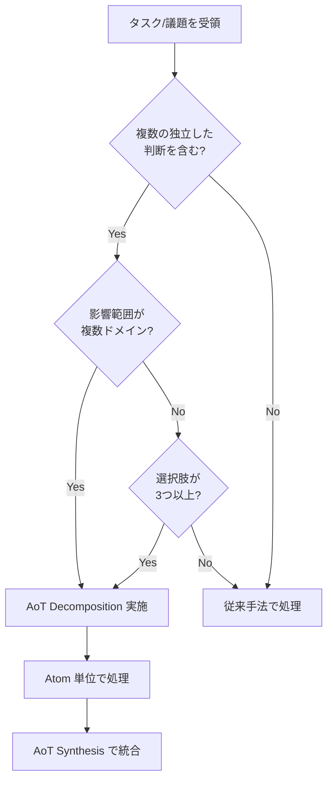
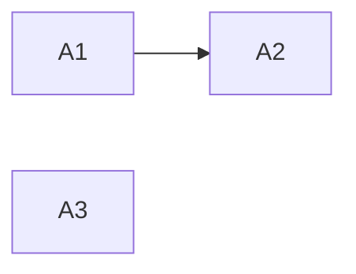

# Multi-Perspective Decision Making Protocol (The "Three Agents" Model)

本ドキュメントは、重要な意思決定（ADR 策定、アーキテクチャ設計、複雑な仕様策定）において適用される「3 つの視点」による合議プロトコルを定義する。

## 1. Core Concept

単一の視点によるバイアスを防ぎ、堅牢かつ革新的な解を導き出すため、以下の 3 つの仮想エージェント（ペルソナ）を脳内でシミュレートし、議論させる。

| Agent           | Persona                    | Role & Focus                                                                                                                                    | Key Question                                             |
| :-------------- | :------------------------- | :---------------------------------------------------------------------------------------------------------------------------------------------- | :------------------------------------------------------- |
| **Affirmative** | **The Proponent (推進者)** | **Value, Speed, Innovation**<br>メリットを最大化し、可能性を広げる。楽観的。                                                                    | 「最高の結果はどうなるか？」「どうすれば実現できるか？」 |
| **Critical**    | **The Skeptic (批判者)**   | **Risk, Security, Debt**<br>欠陥、エッジケース、将来の負債を指摘する。悲観的。                                                                  | 「最悪の場合どうなるか？」「何が壊れるか？」             |
| **Mediator**    | **The Architect (調停者)** | **Synthesis, Balance, Decision**<br>両者の意見を統合し、現実的な落とし所（Trade-off）を決める。合意に至らない場合は独断で決定を下す権限を持つ。 | 「今、我々が取るべき最善のバランスは何か？」             |

## 2. Execution Flow

複雑なタスク（目安: 影響範囲が複数のファイルに及ぶ、または不可逆な決定を含むもの）において、以下のステップを実行する。

### Step 1: Divergence (発散)

Mediator が議題を提示し、Affirmative と Critical がそれぞれの立場から意見を出し尽くす。

- **Affirmative**: ユーザーメリット、開発効率、新技術の導入メリットを列挙。
- **Critical**: セキュリティリスク、パフォーマンス懸念、保守コスト、移行の難易度を列挙。

### Step 2: Debate (議論)

対立するポイントについて、具体的な解決策や緩和策を検討する。
（例: Critical「セキュリティが不安だ」 -> Affirmative「では認証層を強化しよう」）

### Step 3: Convergence (収束)

Mediator が議論を整理し、最終的な決定（Decision）を下す。
決定内容は **ADR (Architecture Decision Record)** または **仕様書** に反映される。
必ず「採用しなかった選択肢」とその理由も記録すること。

## 3. Output Format (Example)

思考プロセス（Thought Process）において、以下のような形式で記録することを推奨する。

```markdown
### Multi-Perspective Analysis

**[Affirmative]**:

- X を採用することで、開発速度が 2 倍になる。
- 最新のライブラリ機能を使えるため、UX が向上する。

**[Critical]**:

- X はまだベータ版であり、API が不安定なリスクがある。
- 既存の Y との互換性を維持するためのラッパーが必要になり、複雑化する。

**[Mediator]**:

- 開発速度は魅力的だが、安定性を犠牲にはできない。
- **結論**: X を採用するが、コア機能への導入は避け、まずは周辺機能で試験導入する（段階的移行）。
- **Action**: ラッパー層の設計をタスクに追加する。
```

## 4. When to Use

- 新しいライブラリやフレームワークの選定時
- データベーススキーマの変更時
- 既存コードの大規模なリファクタリング時
- ユーザー要件が曖昧で、複数の解釈が可能な時

## 5. Atom of Thought (AoT) による前処理

複雑な議題を Three Agents で議論する前に、AoT フレームワークを適用して問題を構造化する。

> **本セクションは AoT の SSOT（Single Source of Truth）です。**
> 各エージェントファイルの AoT 関連セクションは、本セクションを参照してください。
>
> **参照時の注意**: セクション番号は将来変更される可能性があります。
> 参照する際は「Section 5: AoT」のようにセクション名を併記してください。

### 5.1. Atom の定義

**Atom（アトム）** とは、以下の3条件を満たす最小の判断・作業単位である:

| 条件 | 説明 |
|------|------|
| **自己完結性** | 他の Atom の実装詳細に依存せず、独立して処理可能 |
| **インターフェース契約** | 入力（Input）と出力（Output）が明確に定義されている |
| **エラー隔離** | 失敗しても他の Atom に影響を伝播しない（検証: Atom A が失敗しても Atom B の Input が変わらないこと） |

**Atom テーブルの標準形式**:

| Atom | 内容 | 依存 |
|------|------|------|
| A1 | [判断/作業の内容] | なし / A0 |

**任意列**: 並列実行の可否を明示したい場合は「並列可否」列を追加可能（例: `可 (A2)` / `-`）

### 5.2. 適用判断フローチャート



### 5.3. 適用条件

以下のいずれかに該当する場合、AoT 前処理を実施する:

| 条件 | 定量的目安 |
|------|-----------|
| 複数の独立した判断を含む | 判断ポイントが **2つ以上** |
| 影響範囲が複数ドメイン | 影響するレイヤー/モジュールが **3つ以上** |
| 選択肢が多い | 有効な選択肢が **3つ以上** |

**判断に迷った場合**: フローチャート（5.2）に従い、「従来手法で処理」に該当しなければ AoT を適用する。

### 5.4. AoT + Three Agents ワークフロー

```
┌─────────────────────────────────────────────────────────┐
│ Step 0: AoT Decomposition（分解）                       │
│   複雑な議題を独立した Atom（判断単位）に分解           │
│   各 Atom の依存関係を DAG として可視化                 │
└─────────────────────────────────────────────────────────┘
                           ↓
┌─────────────────────────────────────────────────────────┐
│ Step 1-3: Three Agents Debate（各 Atom について）       │
│   Atom ごとに Affirmative / Critical / Mediator が議論  │
│   各 Atom の結論は他 Atom に影響しない（エラー隔離）    │
└─────────────────────────────────────────────────────────┘
                           ↓
┌─────────────────────────────────────────────────────────┐
│ Step 4: AoT Synthesis（統合）                           │
│   各 Atom の結論を統合して最終決定を導出               │
│   ADR または仕様書に反映                                │
└─────────────────────────────────────────────────────────┘
```

### 5.5. 出力フォーマット

```markdown
### AoT Decomposition

**議題**: [元の複雑な議題]

**Atom 分解**:
| Atom | 判断内容 | 依存 |
|------|----------|------|
| A1 | [判断1] | なし |
| A2 | [判断2] | A1 |
| A3 | [判断3] | なし |

**依存関係**:


---

### Atom A1: [判断内容]

**[Affirmative]**:
- [メリット1]

**[Critical]**:
- [リスク1]

**[Mediator]**:
- **結論**: [決定]

---

### AoT Synthesis

**統合結論**:
- A1 の結論 + A2 の結論 + A3 の結論 を踏まえ、[最終決定]

**Action Items**:
1. [アクション1]
2. [アクション2]
```
