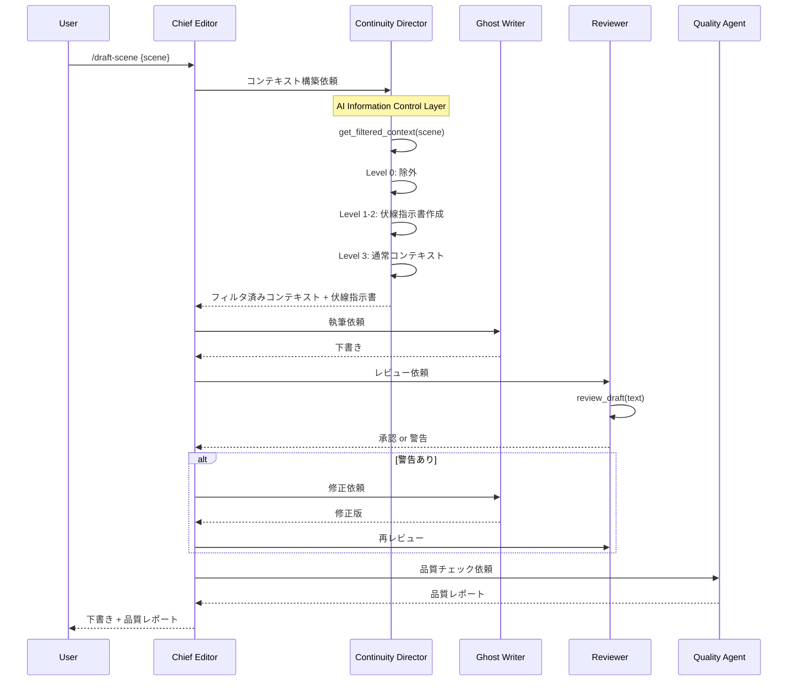

# アーキテクチャ設計書

## 1. システム概要図

```
┌─────────────────────────────────────────────────────────────────────┐
│                        Claude Code CLI                               │
├─────────────────────────────────────────────────────────────────────┤
│                                                                      │
│  ┌─────────────────────────────────────────────────────────────┐   │
│  │                    Orchestration Layer                       │   │
│  │  ┌─────────────┐  ┌─────────────┐  ┌─────────────────────┐  │   │
│  │  │   Chief     │  │  Commands   │  │  Phase-Gate-        │  │   │
│  │  │   Editor    │  │  (User I/F) │  │  Approval           │  │   │
│  │  └─────────────┘  └─────────────┘  └─────────────────────┘  │   │
│  └─────────────────────────────────────────────────────────────┘   │
│                              ↓                                      │
│  ┌─────────────────────────────────────────────────────────────┐   │
│  │                    Agent Layer (The Relay)                   │   │
│  │  ┌───────────┐ ┌───────────┐ ┌───────────┐ ┌───────────┐   │   │
│  │  │Continuity │ │  Ghost    │ │ Reviewer  │ │  Quality  │   │   │
│  │  │ Director  │→│  Writer   │→│  Agent    │→│  Agent    │   │   │
│  │  └───────────┘ └───────────┘ └───────────┘ └───────────┘   │   │
│  └─────────────────────────────────────────────────────────────┘   │
│                              ↓                                      │
│  ┌─────────────────────────────────────────────────────────────┐   │
│  │                 AI Information Control Layer                 │   │
│  │  ┌─────────────┐  ┌─────────────┐  ┌─────────────────────┐  │   │
│  │  │ Visibility  │  │ Expression  │  │ Foreshadowing       │  │   │
│  │  │ Controller  │  │ Filter      │  │ Manager             │  │   │
│  │  └─────────────┘  └─────────────┘  └─────────────────────┘  │   │
│  └─────────────────────────────────────────────────────────────┘   │
│                              ↓                                      │
│  ┌─────────────────────────────────────────────────────────────┐   │
│  │                    Context Builder                           │   │
│  │  ┌─────────────┐  ┌─────────────┐  ┌─────────────────────┐  │   │
│  │  │ Lazy        │  │ Phase       │  │ AoT Parallel        │  │   │
│  │  │ Loader      │  │ Filter      │  │ Collector           │  │   │
│  │  └─────────────┘  └─────────────┘  └─────────────────────┘  │   │
│  └─────────────────────────────────────────────────────────────┘   │
│                              ↓                                      │
│  ┌─────────────────────────────────────────────────────────────┐   │
│  │                    Data Layer (Vault)                        │   │
│  │  ┌─────────┐ ┌─────────┐ ┌─────────┐ ┌─────────┐ ┌───────┐  │   │
│  │  │Episodes │ │Settings │ │Plot/Sum │ │Foreshadow│ │AICtrl │  │   │
│  │  └─────────┘ └─────────┘ └─────────┘ └─────────┘ └───────┘  │   │
│  └─────────────────────────────────────────────────────────────┘   │
│                                                                      │
└─────────────────────────────────────────────────────────────────────┘
```

---

## 2. レイヤー構成

### 2.1 Orchestration Layer（統制レイヤー）

| コンポーネント | 責務 | 実装 |
|--------------|------|------|
| **Chief Editor** | 全体統括、タスク分解、結果統合 | Main System Prompt |
| **Commands** | ユーザーインターフェース | `.claude/commands/` |
| **Phase-Gate-Approval** | 承認ゲート管理、進捗永続化 | `.claude/states/` |

### 2.2 Agent Layer（エージェントレイヤー）

"The Relay" ワークフローによる協調処理：

| エージェント | 責務 | 入力 | 出力 |
|-------------|------|------|------|
| **Continuity Director** | コンテキスト構築、情報フィルタリング | シーン指定 | フィルタ済みコンテキスト |
| **Ghost Writer** | 実テキスト生成 | コンテキスト、スタイルガイド | 下書き |
| **Reviewer Agent** | 情報漏洩チェック | 下書き、秘密リスト | 承認/警告 |
| **Quality Agent** | 品質スコアリング | 下書き | 品質レポート |

### 2.3 AI Information Control Layer（AI情報制御レイヤー）

| コンポーネント | 責務 | 詳細 |
|--------------|------|------|
| **Visibility Controller** | 可視性レベル判定 | Level 0-3 の制御 |
| **Expression Filter** | 表現フィルタリング | 禁止キーワード、類似度チェック |
| **Foreshadowing Manager** | 伏線ライフサイクル管理 | 登録/設置/強化/回収 |

### 2.4 Context Builder（コンテキスト構築レイヤー）

| コンポーネント | 責務 | 対応要件 |
|--------------|------|---------|
| **Lazy Loader** | 必要最小限のデータ読み込み | NFR-001 |
| **Phase Filter** | current_phase に基づくフィルタ | FR-004 |
| **AoT Parallel Collector** | 並列コンテキスト収集 | NFR-003 |

### 2.5 Data Layer（データレイヤー）

Obsidian vault構造：

```
vault/{作品名}/
├── episodes/           # エピソード本文
├── characters/         # キャラクター設定（フェーズ管理）
├── world/              # 世界観設定（フェーズ管理）
├── _plot/              # L1/L2/L3 プロット
├── _summary/           # L1/L2/L3 サマリ
├── _foreshadowing/     # 伏線管理 【新規】
├── _ai_control/        # AI制御設定 【新規】
├── _settings/          # 作品設定 【新規】
│   ├── quality_thresholds.yaml
│   └── pacing_profile.yaml
├── _style_guides/      # 文体ガイド
└── _style_profiles/    # 文体プロファイル
```

---

## 3. コンポーネント詳細

### 3.1 Chief Editor（統括エージェント）

```
責務:
  - ユーザー意図の解釈
  - タスクの分解と各エージェントへの指示
  - 結果の統合とユーザーへの報告
  - Phase-Gate-Approval の管理

実装:
  - Main System Prompt (CLAUDE.md)
  - Phase管理: .claude/current-phase.md
  - 状態永続化: .claude/states/<feature>.json
```

### 3.2 Continuity Director（記録係/門番）

```
責務:
  - 情報制御レイヤーを経由したコンテキスト構築
  - Level 0-2 の秘密をフィルタリング
  - 伏線挿入指示書の作成

入力:
  - シーン指定（L3 sequence）
  - 現在のフェーズ

出力:
  - フィルタ済みコンテキスト
  - 伏線指示書（Level 2 の匂わせ指示）

ツール:
  - get_filtered_context(scene_id) 【必須呼び出し】
```

### 3.3 Ghost Writer（執筆担当）

```
責務:
  - 与えられたコンテキストに基づく執筆
  - スタイルガイドの遵守
  - 設定の矛盾回避（渡されたコンテキスト内で）

入力:
  - フィルタ済みコンテキスト
  - 伏線指示書
  - スタイルガイド

出力:
  - 下書きテキスト

制約:
  - 渡されていない情報には触れない
  - 伏線指示書の指示に従う
```

### 3.4 Reviewer Agent（校閲担当）

```
責務:
  - 情報漏洩チェック（Level 0-2 の秘密）
  - 禁止キーワードチェック
  - 設定文類似度チェック

入力:
  - 下書きテキスト
  - 秘密リスト（Level 0-2）
  - 禁止表現リスト

出力:
  - 承認 or 警告（漏洩箇所の指摘）

ツール:
  - review_draft(text) 【必須呼び出し】
```

### 3.5 Quality Agent（品質管理担当）

```
責務:
  - 品質スコアリング
  - 改善提案の生成
  - 閾値との比較

入力:
  - 下書きテキスト
  - 品質閾値設定

出力:
  - 品質レポート（スコア、改善提案）

評価項目:
  - coherence_score
  - pacing_score
  - prose_score
  - character_score
  - style_consistency
  - reader_excitement
  - emotional_resonance
```

---

## 4. データフロー

### 4.1 下書き生成フロー（The Relay）



### 4.2 AoT 並列コンテキスト収集

```
Atom 1: Plot L1     → テーマ、全体方向性
Atom 2: Plot L2     → 章の目的、状態変化目標
Atom 3: Plot L3     → シーン構成、場面リスト
Atom 4: Summary     → これまでの流れ
Atom 5: Characters  → current_phase の状態（フィルタ済み）
Atom 6: WorldSetting→ current_phase の状態（フィルタ済み）
Atom 7: StyleGuide  → 声、対話パターン
Atom 8: Foreshadow  → 伏線指示（Level別）

※ 全Atom独立・並列実行可能
※ AI Information Control Layer 経由でフィルタリング
```

---

## 5. 技術的決定事項

### 5.1 採用技術

| 決定事項 | 選択 | 理由 |
|---------|------|------|
| 実行環境 | Claude Code CLI | Novel-Athanor 継承、Obsidian 統合 |
| データ形式 | Markdown + YAML | 人間可読、Git 親和性 |
| 状態管理 | JSON ファイル | シンプル、デバッグ容易 |
| エージェント定義 | Markdown | 宣言的、変更容易 |

### 5.2 設計原則

| 原則 | 説明 |
|------|------|
| **情報制御優先** | 全データアクセスはAI Control Layer経由 |
| **ツール強制** | 重要処理は必須ツール呼び出しで制御 |
| **人間最終判断** | 自動化は提案まで、最終判断は人間 |
| **段階的実装** | Level 2 から開始、段階的に拡張 |
| **LLM非依存コア** | コアロジック（Python）はLLM非依存、将来のLocal LLM移行を容易に |

### 5.3 拡張ポイント（Hook）

将来の機能拡張のため、Director層にHookポイントを設ける。

```python
class DirectorHooks:
    """Continuity Director の拡張ポイント"""

    def before_context_build(self, scene_id, config):
        """コンテキスト構築前のフック
        用途: カスタムフィルタ、追加データソース
        """
        pass

    def after_context_build(self, scene_id, context):
        """コンテキスト構築後のフック
        用途: コンテキスト加工、ログ出力
        """
        pass

    def after_draft_generated(self, scene_id, draft):
        """下書き生成後のフック
        用途: カスタム後処理、統計収集
        """
        pass

    def on_review_complete(self, scene_id, review_result):
        """レビュー完了時のフック
        用途: カスタムアラート、学習データ収集
        """
        pass
```

### 5.4 運用ログ

JSONL形式でエージェントの動作を記録する。

**ファイルパス**: `.claude/logs/operations.jsonl`

```jsonl
{"timestamp":"2026-01-24T10:30:00","agent":"Continuity Director","action":"build_context","scene_id":"seq_01_ep010","status":"success","tokens":1500,"duration_ms":1200}
{"timestamp":"2026-01-24T10:30:05","agent":"Ghost Writer","action":"generate","scene_id":"seq_01_ep010","status":"success","tokens":2500,"duration_ms":15000}
{"timestamp":"2026-01-24T10:30:10","agent":"Reviewer","action":"check","scene_id":"seq_01_ep010","status":"warning","issues":1,"duration_ms":800}
```

---

## 6. ディレクトリ構成

```
Auto-Novel-Athanor/
├── CLAUDE.md                      # プロジェクト憲法
├── .claude/
│   ├── agents/                    # エージェント定義
│   │   ├── continuity-director.md
│   │   ├── ghost-writer.md
│   │   ├── reviewer.md
│   │   ├── quality-agent.md
│   │   └── ...
│   ├── commands/                  # スラッシュコマンド
│   ├── skills/                    # 知識ベース
│   │   ├── foreshadowing-rules/   # 【新規】
│   │   └── ...
│   ├── protocols/                 # プロトコル
│   │   └── the-relay.md           # 【新規】
│   ├── rules/                     # ガードレール
│   └── states/                    # 状態管理
│
├── vault/                         # 作品データ
│   └── {作品名}/
│       ├── _foreshadowing/        # 【新規】
│       │   ├── registry.yaml
│       │   └── timeline.yaml
│       ├── _ai_control/           # 【新規】
│       │   └── visibility.yaml
│       └── ...
│
├── src/
│   └── analyzers/                 # 分析モジュール
│
└── docs/
    ├── internal/                  # SSOT
    └── specs/                     # 仕様書
```
