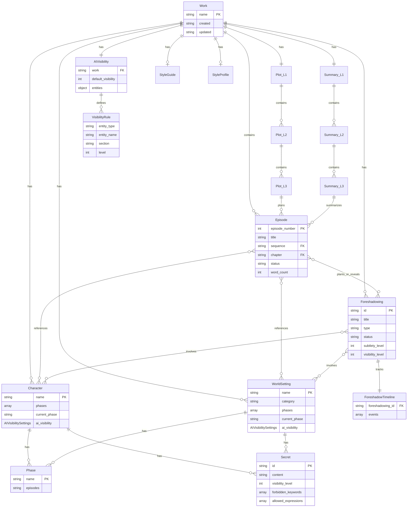

# データモデル仕様書

## 1. エンティティ一覧

```
┌─────────────────────────────────────────────────────────────┐
│                    Entity Overview                          │
├─────────────────────────────────────────────────────────────┤
│ 作品データ                                                   │
│  ├─ Episode (エピソード)         ... 本文                   │
│  ├─ Character (キャラクター)     ... フェーズ管理           │
│  ├─ WorldSetting (世界観設定)    ... フェーズ管理           │
│  ├─ Plot (プロット)              ... L1/L2/L3 階層          │
│  ├─ Summary (サマリ)             ... L1/L2/L3 階層          │
│  ├─ Foreshadowing (伏線)         ... 【新規】               │
│  ├─ AIVisibility (AI可視性)      ... 【新規】               │
│  ├─ Settings (作品設定)          ... 【新規】               │
│  ├─ StyleGuide (文体ガイド)      ... 定性                   │
│  └─ StyleProfile (文体プロファイル) ... 定量                 │
└─────────────────────────────────────────────────────────────┘
```

---

## 2. ER図



> **注記: AIVisibilitySettings の定義**
>
> `Character` および `WorldSetting` の `ai_visibility` フィールドは `AIVisibilitySettings` 型であり、以下のフィールドを持つ:
> - `default`: int (0-3) -- セクション未指定時のデフォルト可視性
> - `hidden_section`: int (0-3) -- 「隠し設定」セクションの可視性
>
> 実装: `src/core/models/character.py` の `AIVisibilitySettings` クラス。
> `WorldSetting` は同クラスを共有（`src/core/models/world_setting.py` 参照）。

---

## 3. エンティティ詳細

### 3.1 Episode（エピソード）

**ファイルパス**: `vault/{作品名}/episodes/ep_{XXXX}.md`

```yaml
---
type: episode
work: "作品名"
episode_number: 1
title: "エピソードタイトル"
sequence: "シーケンス名"
chapter: "章名"
status: draft  # draft | complete | published
word_count: 0
created: YYYY-MM-DD
updated: YYYY-MM-DD
tags:
  - episode
  - "作品名"
---

## メタ情報

| 項目 | 値 |
|------|-----|
| シーケンス | [[seq_01]] |
| 章 | [[01_章名]] |
| ステータス | draft |

## 登場キャラクター

- [[キャラ名1]]
- [[キャラ名2]]

## 登場設定

- [[場所名]]

## 本文

（エピソード本文）

## 執筆メモ

（作者用メモ - AI参照対象外推奨）
```

### 3.2 Character（キャラクター）

**ファイルパス**: `vault/{作品名}/characters/{キャラ名}.md`

```yaml
---
type: character
name: "キャラクター名"
phases:
  - name: "物語開始時"
    episodes: "1-10"
  - name: "覚醒後"
    episodes: "11-"
current_phase: "物語開始時"
ai_visibility:
  default: 0  # Secure by Default - 明示的に公開設定するまで秘匿
  hidden_section: 0
created: YYYY-MM-DD
updated: YYYY-MM-DD
tags:
  - character
---

## 現在の状態
<!-- ai_visibility: 3 -->
（current_phaseの状態）

## フェーズ別記録

### 物語開始時
<!-- ai_visibility: 3 -->

#### 外見
...

#### 性格
...

#### 立場
...

#### 能力
...

#### 関係
...

### 覚醒後
（同様の構造）

## 隠し設定
<!-- ai_visibility: 0 -->

- 実は...
- 最終話で明かされる...
```

### 3.3 Foreshadowing（伏線）【新規】

**ファイルパス**: `vault/{作品名}/_foreshadowing/registry.yaml`

詳細は `05_foreshadowing-system.md` を参照。

### 3.4 AIVisibility（AI可視性設定）【新規】

**ファイルパス**: `vault/{作品名}/_ai_control/visibility.yaml`

詳細は `04_ai-information-control.md` を参照。

### 3.5 Plot L1/L2/L3（プロット）

**ファイルパス**:
- L1: `vault/{作品名}/_plot/L1_overall.md`
- L2: `vault/{作品名}/_plot/L2_chapters/{章番号}_{章名}.md`
- L3: `vault/{作品名}/_plot/L3_sequences/{章番号}_{章名}/seq_{番号}.md`

```yaml
# L1 例
---
type: plot
level: L1
work: "作品名"
---

## ログライン
（1文要約）

## テーマ
...

## 三幕構成

### 第一幕: 発端
...

### 第二幕: 葛藤
...

### 第三幕: 解決
...

## キャラクターアーク
...

## 伏線マスターリスト

| 伏線ID | タイトル | 設置予定 | 回収予定 | ステータス |
|--------|---------|---------|---------|-----------|
| FS-03-rocket | 主人公の秘密 | EP-003 | EP-050 | planted |

> **ID命名規則**: `FS-{episode}-{slug}` 形式（例: FS-03-rocket = 3話で植えたロケットの伏線）

## 章構成

- [[L2_chapters/01_第一章]]
- [[L2_chapters/02_第二章]]
```

### 3.6 Summary L1/L2/L3（サマリ）

**ファイルパス**:
- L1: `vault/{作品名}/_summary/L1_overall.md`
- L2: `vault/{作品名}/_summary/L2_chapters/{章番号}_{章名}.md`
- L3: `vault/{作品名}/_summary/L3_sequences/{章番号}_{章名}/seq_{番号}.md`

---

## 4. データフロー

### 4.1 Plot vs Summary

```
┌─────────────────────────────────────────────────────────────┐
│              Plot（計画）    vs    Summary（実績）           │
├─────────────────────────────────────────────────────────────┤
│  Plot L1 (全体計画)      ←→    Summary L1 (全体実績)       │
│     ↓                              ↓                        │
│  Plot L2 (章計画)        ←→    Summary L2 (章実績)         │
│     ↓                              ↓                        │
│  Plot L3 (シーケンス計画) ←→   Summary L3 (シーケンス実績)  │
│     ↓                              ↓                        │
│  [執筆予定]              →     Episode [実際の本文]         │
└─────────────────────────────────────────────────────────────┘

用途:
- Plot: 「こう書く予定」の設計図
- Summary: 「こう書いた」の実績記録
- 比較することで計画との乖離を検出
```

### 4.2 フェーズ管理フロー

```
フェーズ定義時:
  1. phases 配列にフェーズを追加
  2. episodes 範囲を設定
  3. フェーズ別記録セクションを作成

フェーズ切替時:
  1. current_phase を更新
  2. 新フェーズの記録を作成
  3. AI参照時は current_phase のみ使用
```

#### フェーズ管理の層別責務

| レイヤー | 責務 | 具体的な処理 |
|---------|------|------------|
| **L1 (Data)** | フェーズデータの保持 | `phases` 配列と `current_phase` の管理 |
| **L2 (AI Control)** | (使用せず) | フェーズフィルタリングはAI情報制御とは独立 |
| **L3 (Context)** | フェーズフィルタリング実行 | `PhaseFilter` が `current_phase` に基づいてコンテンツをフィルタ |
| **L4 (Agent)** | `current_phase` の指定 | `SceneIdentifier.current_phase` でフェーズを伝達 |

> **注**: L1 はフェーズのメタデータ管理のみを行い、
> フィルタリングロジック自体は L3 のコンテキスト構築時に実行される。

---

## 5. ストレージ形式

| エンティティ | 形式 | メタデータ | ファイルパス |
|-------------|------|-----------|-------------|
| Episode | Markdown | YAML frontmatter | `episodes/ep_{XXXX}.md` |
| Character | Markdown | YAML frontmatter | `characters/{名前}.md` |
| WorldSetting | Markdown | YAML frontmatter | `world/{名前}.md` |
| Plot | Markdown | YAML frontmatter | `_plot/L{1-3}_*.md` |
| Summary | Markdown | YAML frontmatter | `_summary/L{1-3}_*.md` |
| Foreshadowing | YAML | - | `_foreshadowing/registry.yaml` |
| AIVisibility | YAML | - | `_ai_control/visibility.yaml` |
| Settings | YAML | - | `_settings/*.yaml` |
| StyleGuide | Markdown | YAML frontmatter | `_style_guides/*.md` |
| StyleProfile | Markdown | YAML frontmatter | `_style_profiles/*.md` |

---

## 6. 大規模作品対応

### 6.1 Volume（巻）単位のディレクトリ分割

> **実装ステータス**: 将来実装予定。現行バージョンでは未実装。
> 100EP以上の大規模作品対応時に実装する計画。

100エピソード以上の大規模作品では、Volume単位でディレクトリを分割する。

```
vault/{作品名}/
├── episodes/
│   ├── Vol.1/
│   │   ├── ep_0001.md
│   │   ├── ep_0002.md
│   │   └── ...
│   ├── Vol.2/
│   │   ├── ep_0050.md
│   │   └── ...
│   └── Vol.3/
│       └── ...
├── characters/
├── world/
├── _foreshadowing/
└── _ai_control/
```

### 6.2 過去参照（スナップショット）

> **実装ステータス**: 将来実装予定。現行バージョンでは未実装。
> 大規模作品（100EP以上）対応時に実装する計画。

「重要イベントサマリ」を維持し、過去の状態を参照可能にする。

```yaml
# _summary/event_snapshots.yaml
event_snapshots:
  - event_id: EVT-001
    title: "主人公の覚醒"
    episode: "EP-025"
    summary: "主人公が隠された力に目覚めた瞬間..."
    affected_characters:
      - name: "主人公"
        changes:
          - "current_phase: 覚醒後"
          - "ability: 新能力解放"
    git_commit: "abc1234"  # スナップショットのコミットハッシュ
```

---

## 7. データ堅牢性

### 7.1 循環参照対策

> **実装方針**: 循環参照対策は2段階で実装する:
> 1. L1 パーサーに `parse_with_depth_limit()` を追加（YAML/frontmatter の再帰パース制限）
> 2. L3 コンテキスト構築時の参照解決制限（Markdown の `[[リンク]]` 循環検出）
>
> 現在の実装では Markdown リンクの深追い解決は行わないため、
> 循環参照による無限ループリスクは低い。ただし、YAML構造の深い入れ子には
> 深度制限を設けることを推奨する。

Markdownリンクレベルでの循環参照は許容するが、JSONパース時に再帰深度制限を設ける。

```python
MAX_RECURSION_DEPTH = 10

def parse_with_depth_limit(data, current_depth=0):
    """循環参照による無限ループを防止"""
    if current_depth > MAX_RECURSION_DEPTH:
        raise RecursionLimitError(f"再帰深度上限（{MAX_RECURSION_DEPTH}）を超えました")

    if isinstance(data, dict):
        return {k: parse_with_depth_limit(v, current_depth + 1)
                for k, v in data.items()}
    elif isinstance(data, list):
        return [parse_with_depth_limit(item, current_depth + 1)
                for item in data]
    else:
        return data
```

### 7.2 パース失敗時のフォールバック

YAMLやfrontmatterのパースに失敗した場合、生のMarkdownテキストとしてコンテキストに含める。

```python
def load_entity_with_fallback(file_path):
    """パース失敗時は生テキストでフォールバック"""
    try:
        # 正常パース試行
        content = read_file(file_path)
        frontmatter, body = parse_frontmatter(content)
        return {
            'type': 'structured',
            'frontmatter': frontmatter,
            'body': body
        }
    except ParseError as e:
        # フォールバック: 生テキストとして返す
        logger.warning(f"パース失敗: {file_path}, フォールバックで続行")
        return {
            'type': 'raw_text',
            'content': content,
            'error': str(e)
        }
```

### 7.3 設定共有機能

> **実装ステータス**: 将来実装予定。現行バージョンでは未実装。
> 複数作品管理機能の導入時に実装する計画。

複数作品間で共通設定（魔法体系、世界観など）を共有する。

```yaml
# vault/{作品名}/world/magic.md
---
type: world_setting
import: "vault/shared/magic_system.md"  # 外部参照
override:
  - "詠唱方法"  # ローカルで上書きするセクション
---

## 詠唱方法
（この作品固有の設定）

## 魔法体系
<!-- imported from shared/magic_system.md -->
```

**または、共有ディレクトリをマウント**:

```
vault/
├── shared/             # 共有設定
│   └── magic_system.md
├── 作品A/
│   └── world/
│       └── magic.md → ../../shared/magic_system.md (symlink)
└── 作品B/
    └── world/
        └── magic.md → ../../shared/magic_system.md (symlink)
```

---

## 8. 互換性

### 8.1 Obsidian互換

- `[[リンク]]` 記法によるファイル間参照
- YAML frontmatter
- vault構造

### 8.2 Git互換

- テキストベース（Diff可読）
- 行単位の変更追跡
- マージ可能

### 8.3 Novel-Athanor互換

- 既存のディレクトリ構造を維持
- 新規ディレクトリ（`_foreshadowing/`, `_ai_control/`）を追加
- 既存ファイルは `ai_visibility` 属性を追加するだけで対応可能
