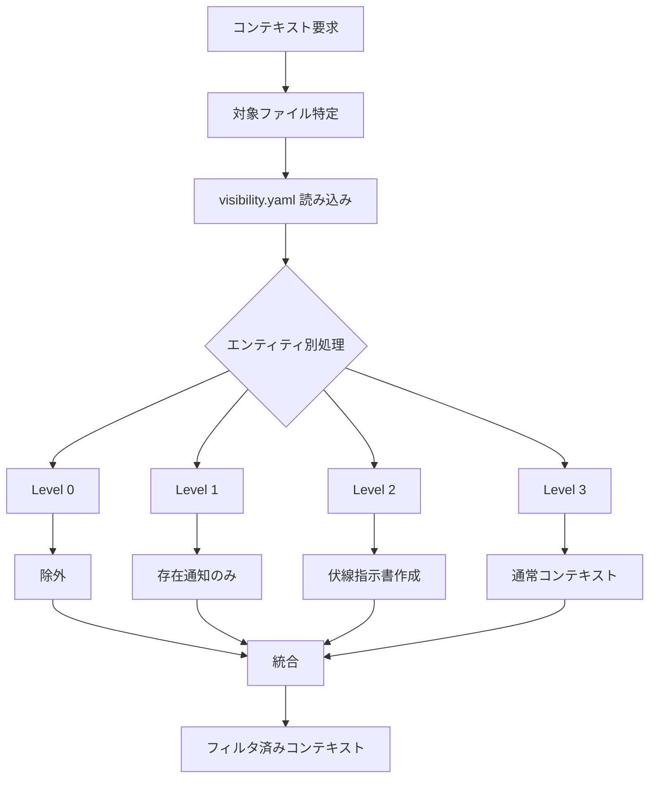

# AI情報制御システム詳細仕様

## 1. 概要

### 1.1 目的

AIが設定情報をどの程度認識・使用できるかを制御し、**ネタバレや伏線の種明かしが意図せず文章に混入することを防止**する。

### 1.2 設計根拠

ユーザー要望（最重要要件）:
> 「隠し設定とかに関しては読者に対する隠しもあるけれども、AIがそれを知ったことによって文章に混ぜてしまうことを一番恐れている」

### 1.3 既存システムの課題

| システム | 現状 | 課題 |
|---------|------|------|
| Novel-Athanor | `## 隠し設定` セクション | 2段階（見せる/見せない）のみ |
| NovelWriter | なし | AI制御の概念なし |
| 302_novel_writing | なし | AI制御の概念なし |

---

## 2. 4段階可視性モデル

### 2.1 レベル定義

| Level | 名称 | AIの認識 | AIの行動 |
|-------|------|---------|---------|
| **0** | 完全秘匿 | 存在すら知らない | 何も書けない |
| **1** | 認識のみ | 「何かある」と知る | 内容には触れない |
| **2** | 内容認識 | 内容を知っている | 文章には出さない（暗示は可） |
| **3** | 使用可能 | 完全に把握 | 文章で使ってよい |

### 2.2 レベル別プロンプト制御

#### Level 0: 完全秘匿

```
処理: コンテキストに一切含めない
AI認識: 存在自体を知らない
```

#### Level 1: 認識のみ — プロンプトテンプレート

**設計根拠**: 「ピンクの象について考えないで」と言われると考えてしまう現象（Pink Elephant Paradox）を回避するため、否定命令ではなく「コンテキスト外の要素がある」と淡々と伝える設計を採用。

**テンプレート変数**:

| 変数 | 説明 | 例 |
|------|------|-----|
| `{entity_type}` | エンティティ種別 | character, world_setting 等 |
| `{entity_name}` | エンティティ名 | アイラ, 魔法体系 等 |
| `{section_name}` | セクション名 | 隠し設定, 禁忌の魔法 等 |
| `{hint_text}` | 存在通知テキスト（カスタマイズ可能） | ※省略時はデフォルト文を使用 |

**デフォルトテンプレート**:

```yaml
# テンプレートファイル: vault/{作品名}/_ai_control/templates/level1_hint.yaml
template_id: level1_default
version: "1.0"
description: "Level 1 認識のみ — 情報不在通知テンプレート"

prompt_template: |
  {entity_name}の{section_name}に関する一部の情報は、
  現在のコンテキストには含まれていません。
  提示された情報のみに基づいて描写してください。
```

**Pink Elephant 回避原則**:
- NG: 「{entity_name}の秘密について触れないでください」（否定命令 → ハルシネーション誘発）
- OK: 「情報が不在である」という事実の提示のみ

#### Level 2: 内容認識 — プロンプトテンプレート

**テンプレート変数**:

| 変数 | 説明 | 例 |
|------|------|-----|
| `{entity_name}` | エンティティ名 | アイラ |
| `{secret_id}` | 秘密ID | SEC-001 |
| `{secret_content}` | 秘密の内容 | アイラは実は王族の血筋 |
| `{forbidden_keywords}` | 禁止キーワードリスト | 王族, 血筋, 高貴, 王家 |
| `{allowed_expressions}` | 許可表現リスト | ※下記参照 |
| `{subtlety_level}` | 微細度 (1-10) | 5 |
| `{subtlety_guideline}` | 微細度に応じた執筆指針 | ※`05_foreshadowing-system.md` Section 2.3 参照 |

**デフォルトテンプレート**:

```yaml
# テンプレートファイル: vault/{作品名}/_ai_control/templates/level2_secret.yaml
template_id: level2_default
version: "1.0"
description: "Level 2 内容認識 — 秘密情報制御テンプレート"

prompt_template: |
  【執筆参考情報（文章への直接使用禁止）】
  以下の情報は物語の暗示や緊張感の構築に活用できますが、
  明示的に述べることは禁止されています。

  参考情報: {secret_content}

  使用禁止キーワード: {forbidden_keywords}

  許可される表現パターン:
  {allowed_expressions}

  微細度指針: {subtlety_guideline}
```

**Pink Elephant 回避原則（Level 2 固有）**:
- NG: 「{entity_name}が王族であることを書かないでください」（否定命令 → 逆に意識させる）
- OK: 許可表現リストで「書いてよいもの」を明示し、それ以外は自然と排除される設計

#### Level 3: 使用可能

```
処理: 通常のコンテキストとして含める
AI認識: 完全に把握
制限: なし
```

### 2.3 プロンプトテンプレート管理

#### テンプレート管理ファイルパス

```
vault/{作品名}/_ai_control/templates/
  level1_hint.yaml          # Level 1 用テンプレート
  level2_secret.yaml        # Level 2 用テンプレート
  custom/                   # 作品固有のカスタムテンプレート
    level1_mystery.yaml     # 例: ミステリー向けカスタム
    level2_fantasy.yaml     # 例: ファンタジー向けカスタム
```

#### テンプレート構造 (YAML)

```yaml
# テンプレート共通構造
template_id: string         # テンプレート識別子（一意）
version: string             # テンプレートバージョン
description: string         # テンプレートの説明
level: int                  # 対象可視性レベル (1 or 2)

# テンプレート本体
prompt_template: string     # プロンプトテンプレート文字列（変数埋め込み対応）

# メタデータ（オプション）
metadata:
  author: string            # テンプレート作成者
  genre: string             # 推奨ジャンル
  notes: string             # 使用上の注意
```

#### デフォルトテンプレートの提供

システムはLevel 1およびLevel 2のデフォルトテンプレートを内蔵する。
ユーザーが `_ai_control/templates/` にカスタムテンプレートを配置した場合、
そちらが優先的に使用される。

**テンプレート解決順序**:
1. エンティティ固有テンプレート（visibility.yaml で `template_id` 指定時）
2. 作品カスタムテンプレート（`_ai_control/templates/custom/`）
3. 作品デフォルトテンプレート（`_ai_control/templates/`）
4. システム内蔵テンプレート（フォールバック）

---

## 3. データ構造

### 3.0 デフォルト可視性ポリシー

本システムは **Secure by Default** 原則（Section 2.1）に基づき、すべての情報を秘匿状態から開始する。

| 場面 | デフォルト値 | 理由 |
|------|------------|------|
| 新規エンティティ | HIDDEN (0) | Secure by Default 原則 |
| 既存作品インポート | HIDDEN (0) | 安全側にデフォルト |
| ユーザー指定 | 任意 (0-3) | visibility.yaml で明示的に設定 |

**注意**: `default_visibility: 3` を設定することでオープンポリシーに切り替え可能だが、
秘密情報の漏洩リスクを十分に理解した上で設定すること。

### 3.1 可視性設定ファイル

**ファイルパス**: `vault/{作品名}/_ai_control/visibility.yaml`

```yaml
# AI情報制御設定
version: "1.0"

# デフォルト可視性（新規設定のデフォルト値）
# Secure by Default: 明示的に公開設定しない限り秘匿
default_visibility: 0

# エンティティ別可視性設定
entities:
  # キャラクター設定
  characters:
    アイラ:
      sections:
        基本情報: 3
        現在の状態: 3
        フェーズ別記録: 3
        隠し設定: 0  # 完全秘匿

      # 特定の情報に対する細かい制御
      secrets:
        - id: SEC-001
          content: "アイラは実は王族の血筋"
          visibility: 2
          forbidden_keywords:
            - "王族"
            - "血筋"
            - "高貴"
            - "王家"
          allowed_expressions:
            - "彼女の瞳には見覚えのある光があった"
            - "その立ち振る舞いには育ちの良さが滲み出ていた"

  # 世界観設定
  world_settings:
    魔法体系:
      sections:
        概要: 3
        詳細: 3
        禁忌の魔法: 1  # 存在のみ認識

  # 伏線
  foreshadowing:
    FS-001:
      visibility: 2
      # 伏線固有の設定は _foreshadowing/ で管理
```

### 3.2 エンティティ内の可視性マーカー

**キャラクターファイル例**: `vault/{作品名}/characters/アイラ.md`

```yaml
---
type: character
name: "アイラ"
phases:
  - name: "物語開始時"
    episodes: "1-10"
  - name: "覚醒後"
    episodes: "11-"
current_phase: "物語開始時"
ai_visibility:
  default: 0  # Secure by Default - 明示的に公開設定するまで秘匿
  hidden_section: 0
---

## 現在の状態
（current_phaseの状態 - Level 3）

## フェーズ別記録
（各フェーズの詳細 - Level 3）

## 隠し設定
<!-- ai_visibility: 0 -->
- 実は王族の血筋である
- 最終話で明かされる真実...
```

---

## 4. 処理フロー

### 4.1 コンテキスト構築フロー



### 4.2 Visibility Controller 擬似コード

```python
def get_filtered_context(scene_id, visibility_config):
    context = {}
    hints = []
    forbidden_all = []

    for entity_type, entities in visibility_config['entities'].items():
        for entity_name, config in entities.items():
            entity_data = load_entity(entity_type, entity_name)

            for section, level in config.get('sections', {}).items():
                if level == 0:
                    # 完全秘匿: 何も追加しない
                    continue
                elif level == 1:
                    # 認識のみ: 存在通知
                    hints.append(f"{entity_name}には秘密があります（内容不明）")
                elif level == 2:
                    # 内容認識: 伏線指示書作成
                    for secret in config.get('secrets', []):
                        hints.append(create_hint_instruction(secret))
                        forbidden_all.extend(secret.get('forbidden_keywords', []))
                else:  # level == 3
                    # 使用可能: 通常追加
                    context[f"{entity_type}/{entity_name}/{section}"] = entity_data[section]

    return {
        'context': context,
        'hint_instructions': hints,
        'forbidden_keywords': forbidden_all
    }
```

---

## 5. Expression Filter（表現フィルタ）

### 5.1 禁止キーワードチェック

```python
def check_forbidden_keywords(text, forbidden_keywords):
    violations = []
    for keyword in forbidden_keywords:
        if keyword in text:
            violations.append({
                'keyword': keyword,
                'positions': find_all_positions(text, keyword)
            })
    return violations
```

### 5.2 類似度チェック

秘密の内容と生成文の類似度を計算し、閾値を超えた場合に警告。

**動的閾値**: 重要な秘密ほど閾値を低く（敏感に）設定する。

```python
def check_similarity(text, secret_content, base_threshold=0.7, importance="medium"):
    # 重要度に応じた動的閾値調整
    threshold_adjustments = {
        "critical": -0.15,  # 0.55: 最も敏感
        "high": -0.10,      # 0.60
        "medium": 0.0,      # 0.70: 基準値
        "low": 0.05         # 0.75: 緩い
    }
    threshold = base_threshold + threshold_adjustments.get(importance, 0.0)

    # 文単位で類似度計算
    for sentence in split_sentences(text):
        similarity = calculate_similarity(sentence, secret_content)
        if similarity > threshold:
            return {
                'warning': True,
                'sentence': sentence,
                'similarity': similarity,
                'threshold_used': threshold
            }
    return {'warning': False}
```

### 5.3 意味的埋め込みチェック

キーワードマッチだけでなく、**意味的埋め込み（Embedding）**による類似性チェックを実施。
言い換えや婉曲表現による情報漏洩を検出する。

```python
def check_semantic_similarity(text, secret_content, embedding_model, threshold=0.75):
    """
    意味的な類似性をEmbeddingで検出。
    キーワードを使わずに秘密を暗示している場合も検出可能。
    """
    secret_embedding = embedding_model.encode(secret_content)

    for sentence in split_sentences(text):
        sentence_embedding = embedding_model.encode(sentence)
        similarity = cosine_similarity(secret_embedding, sentence_embedding)

        if similarity > threshold:
            return {
                'warning': True,
                'sentence': sentence,
                'semantic_similarity': similarity,
                'note': "言い換えまたは婉曲表現による潜在的な情報漏洩"
            }
    return {'warning': False}
```

### 5.4 設定文直接引用チェック

設定ファイルの文章がそのまま生成文に含まれていないかチェック。

```python
def check_direct_quotation(text, setting_texts, min_length=20):
    violations = []
    for setting in setting_texts:
        # 20文字以上の連続一致を検出
        matches = find_long_matches(text, setting, min_length)
        if matches:
            violations.extend(matches)
    return violations
```

---

## 6. Reviewer Agent 仕様

### 6.1 責務

生成されたテキストをレビューし、情報漏洩がないかチェックする。

### 6.2 入力

```yaml
draft_text: "生成された下書き"
secrets:
  - id: SEC-001
    content: "アイラは実は王族の血筋"
    visibility: 2
    forbidden_keywords: ["王族", "血筋", "高貴"]
forbidden_keywords_global: ["禁忌の魔法", "最終兵器"]
```

### 6.3 チェック項目

| チェック | 説明 | 重要度 |
|---------|------|--------|
| 禁止キーワード | forbidden_keywords の出現 | Critical |
| 意味的類似度 | Embedding類似度 > 0.75（言い換え検出） | Critical |
| 類似度 | 秘密内容との文字列類似度 > 動的閾値 | High |
| 直接引用 | 設定文の20文字以上一致 | High |
| 暗示過剰 | Level 2 の暗示が明確すぎる | Medium |
| 潜在的暗示 | 初見読者が秘密を推測できる描写 | Medium |

### 6.4 出力

```yaml
result: "approved" | "warning" | "rejected"
issues:
  - type: "forbidden_keyword"
    severity: "critical"
    location: "第3段落"
    detail: "「王族」というキーワードが使用されています"
    suggestion: "「高貴な雰囲気」などの曖昧な表現に変更してください"
  - type: "similarity"
    severity: "high"
    location: "第5段落"
    detail: "秘密SEC-001との類似度が0.82です"
    suggestion: "表現を変更してください"
```

---

## 7. 伏線との連携

### 7.1 伏線の可視性制御

| 伏線ステータス | 推奨Level | 説明 |
|---------------|-----------|------|
| registered | 0 | まだ張っていない |
| planted | 1-2 | 張っている最中 |
| reinforced | 2 | 強化中 |
| revealed | 3 | 回収済み |

### 7.2 段階的開示フロー

```
1. 伏線登録時
   status: registered
   ai_visibility: 0
   → AIは存在を知らない

2. 伏線を張る時
   status: planted
   ai_visibility: 2
   → AIは内容を知るが、禁止表現あり
   → allowed_expressions で暗示を許可

3. 伏線回収時
   status: revealed
   ai_visibility: 3
   → AIは自由に使用可能
```

---

## 8. 実装優先順位

| Phase | 内容 | 理由 |
|-------|------|------|
| 1 | Level 0 & 3 の実装 | 最もシンプル（含める/除外） |
| 2 | Level 2 の実装 | 核心機能 |
| 3 | Reviewer Agent | 事後チェック |
| 4 | Level 1 の実装 | 存在通知 |
| 5 | 類似度チェック | 高度な検出 |

---

## 9. 設定例

### 9.1 ミステリー作品の例

```yaml
entities:
  characters:
    探偵:
      sections:
        基本情報: 3
        推理能力: 3
        隠し設定: 0

    犯人:
      secrets:
        - id: SEC-CULPRIT
          content: "メイドの田中が真犯人"
          visibility: 0  # 完全秘匿

    メイド田中:
      secrets:
        - id: SEC-MOTIVE
          content: "田中は被害者に恨みを持っている"
          visibility: 2
          forbidden_keywords:
            - "恨み"
            - "復讐"
            - "殺意"
          allowed_expressions:
            - "彼女の目には何か暗いものがあった"
            - "被害者の名前を聞いた時、一瞬表情が曇った"
```

### 9.2 ファンタジー作品の例

```yaml
entities:
  characters:
    主人公:
      secrets:
        - id: SEC-ORIGIN
          content: "主人公は魔王の転生者"
          visibility: 2
          forbidden_keywords:
            - "魔王"
            - "転生"
            - "前世"
            - "邪悪な力"
          allowed_expressions:
            - "時折、自分でも驚くほどの力が湧き上がることがあった"
            - "古い魔導書を読むと、なぜか懐かしさを感じた"
```
