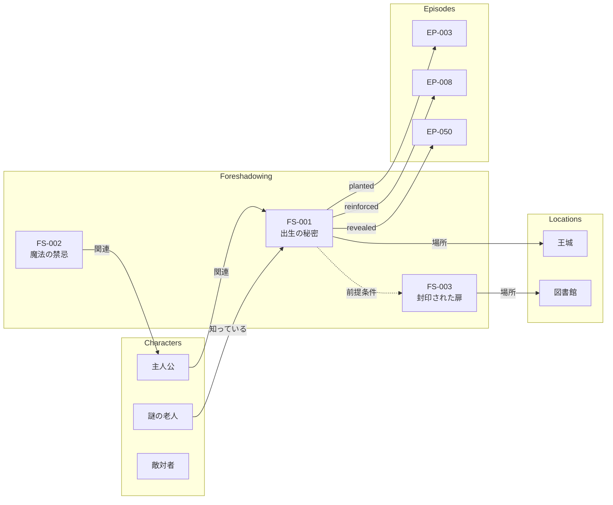

# 伏線管理システム詳細仕様（Chekhov's Gun Tracker）

## 1. 概要

### 1.1 目的

伏線の登録・追跡・回収を体系的に管理し、以下を実現する：
- 伏線の「張り忘れ」「回収忘れ」を防止
- AIによる意図しないネタバレを防止（AI情報制御と連携）
- 伏線の効果的な活用を支援

### 1.2 設計根拠

Antigravity 提案:
> "Chekhov's Gun Tracker" として、伏線を構造化データで管理する

Claude Code 発見:
> 3システムすべてに本格的な伏線管理機能が欠如している

---

## 2. 伏線ライフサイクル

### 2.1 ステータス遷移

```
registered → planted → reinforced → revealed
   ↓            ↓           ↓           ↓
 (登録)      (設置)      (強化)      (回収)
   ↓            ↓           ↓           ↓
Level 0     Level 1-2   Level 2     Level 3
```

| ステータス | 説明 | AI可視性 |
|-----------|------|---------|
| **registered** | アイデアとして登録、まだ本文には出ていない | 0（秘匿） |
| **planted** | 本文中に伏線が張られた | 1-2（認識or内容認識） |
| **reinforced** | 伏線が強化・補強された | 2（内容認識） |
| **revealed** | 伏線が回収された | 3（使用可能） |
| **abandoned** | 回収を断念（理由を記録） | 0（秘匿） |

### 2.2 微細度スケール（subtlety_level）

| 値 | 名称 | 説明 | 例 |
|---|------|------|-----|
| 1-2 | 明白 | 読者が即座に「これは伏線だ」と気づく | 「いつかこれが役立つ時が来る」という台詞 |
| 3-4 | 標準 | 注意深い読者なら気づく | 意味深な描写、繰り返される小道具 |
| 5-6 | 微細 | 初読では気づきにくい | 何気ない会話の中の情報 |
| 7-8 | 隠れ | 再読時に初めて意味がわかる | 背景描写、キャラクターの癖 |
| 9-10 | 極微細 | 回収時に「そういえば」と思い出す程度 | 一度だけ出てくる描写 |

### 2.3 微細度別プロンプト指針（Writer Agent向け）

AIがレベルに応じて書き分けるための具体的なガイドライン:

```yaml
# _settings/subtlety_guidelines.yaml
subtlety_guidelines:

  level_1_2:  # 明白
    name: "明白な伏線"
    allowed:
      - 直接的な台詞での言及
      - キャラクターの明確な反応
      - ナレーションでの強調
    forbidden: []
    example_prompt: |
      この伏線は読者に明確に認識させてください。
      キャラクターの台詞や明確な行動で示します。

  level_3_4:  # 標準
    name: "標準的な伏線"
    allowed:
      - 意味深な視線や表情
      - 繰り返される小道具
      - 対話の中の暗示
    forbidden:
      - 「これは重要だ」等の直接的強調
    example_prompt: |
      この伏線は注意深い読者が気づく程度に描写してください。
      意味深な表情や繰り返しのモチーフを使用します。

  level_5_6:  # 微細
    name: "微細な伏線"
    allowed:
      - 何気ない会話の一部
      - 背景描写への埋め込み
      - 他の出来事の陰に隠す
    forbidden:
      - キャラクターの明確な反応
      - 一文での独立した言及
    example_prompt: |
      この伏線は他の情報に紛れ込ませてください。
      読者の注意が他に向いている場面で自然に挿入します。

  level_7_8:  # 隠れ
    name: "隠れた伏線"
    allowed:
      - 情景描写の一部
      - キャラクターの無意識の癖
      - 比喩や象徴表現
    forbidden:
      - 対話での言及
      - ナレーションでのフォーカス
      - 視点キャラクターの意識的な注目
    example_prompt: |
      この伏線は背景に溶け込ませてください。
      天気、服装の色、部屋の装飾など、情景描写の一部として
      読者が意識しない形で挿入します。

  level_9_10:  # 極微細
    name: "極微細な伏線"
    allowed:
      - 一度だけの短い描写
      - 象徴的な比喩（抽象度高）
      - 省略や暗示
    forbidden:
      - 複数回の言及
      - 具体的な描写
      - キャラクターの反応
    example_prompt: |
      この伏線はほぼ見えない形で挿入してください。
      一文以内、できれば句単位で、読み流される程度に
      抽象的な表現で暗示します。
```

---

## 3. データ構造

### 3.0 伏線ID命名規則

伏線IDは `FS-{episode}-{slug}` 形式を採用する。

| 形式 | 説明 | 例 |
|------|------|-----|
| `FS-{episode}` | 伏線が最初に植えられたエピソード番号 | `FS-03` = 第3話で設置 |
| `{slug}` | 伏線の内容を表す短い英語識別子 | `rocket`, `secret`, `sealed-door` |

**例**:
- `FS-03-rocket` = 第3話で植えたロケットの伏線
- `FS-08-sealed-door` = 第8話で植えた封印された扉の伏線
- `FS-12-forbidden-magic` = 第12話で植えた禁じられた魔法の伏線

**利点**:
- 人間可読: IDだけで「どこで何を」が分かる
- デバッグ容易: ログやエラーメッセージで追跡しやすい
- 衝突回避: episode + slug の組み合わせでユニーク性を担保

### 3.1 ディレクトリ構成

```
vault/{作品名}/_foreshadowing/
├── registry.yaml          # 伏線マスター登録簿
├── timeline.yaml          # 伏線タイムライン（エピソード順）
└── archives/              # 回収済み・破棄済みの詳細
    └── {伏線ID}.md
```

### 3.2 伏線登録簿（registry.yaml）

```yaml
# 伏線マスター登録簿
version: "1.0"
last_updated: "2026-01-24"

foreshadowing:
  - id: FS-03-rocket  # 第3話で植えたロケットの伏線
    title: "主人公の出生の秘密"
    type: character_secret
    status: planted
    subtlety_level: 7

    # AI情報制御
    ai_visibility:
      level: 2
      forbidden_keywords:
        - "王族"
        - "血筋"
        - "高貴"
      allowed_expressions:
        - "彼女の瞳には見覚えのある光があった"
        - "その立ち振る舞いには育ちの良さが滲み出ていた"

    # 伏線の内容
    seed:
      content: "主人公が古びたロケットを持っている"
      description: "何気なくロケットを触る描写"

    payoff:
      content: "ロケットの中の写真が敵の正体を示している"
      planned_episode: "EP-050"
      description: "ロケットを開くと、そこには..."

    # タイムライン
    timeline:
      registered_at: "2026-01-20"
      events:
        - episode: "EP-003"
          type: planted
          date: "2026-01-21"
          expression: "彼女はいつもロケットを握りしめていた"
          subtlety: 5
        - episode: "EP-008"
          type: reinforced
          date: "2026-01-22"
          expression: "ロケットの表面に刻まれた紋章を見て、誰かが驚いた"
          subtlety: 4

    # 関連要素
    related:
      characters:
        - "主人公"
        - "謎の老人"
      plot_threads:
        - "PT-003"
      locations:
        - "王城"

    # 依存関係（前提条件）
    prerequisite:
      - "FS-08-sealed-door/planted"  # 封印された扉が planted になるまで設置不可
      # または
      - "FS-12-forbidden-magic/revealed" # 禁じられた魔法が回収されるまで設置不可

  - id: FS-12-forbidden-magic  # 第12話で植えた禁じられた魔法の伏線
    title: "魔法の禁忌"
    type: world_reveal
    status: registered
    subtlety_level: 8
    # ...
```

### 3.3 伏線タイムライン（timeline.yaml）

エピソード順に伏線イベントを時系列で表示：

```yaml
# 伏線タイムライン
version: "1.0"

timeline:
  - episode: "EP-001"
    events: []

  - episode: "EP-003"
    events:
      - foreshadowing_id: FS-03-rocket
        type: planted
        expression: "彼女はいつもロケットを握りしめていた"

  - episode: "EP-008"
    events:
      - foreshadowing_id: FS-03-rocket
        type: reinforced
        expression: "ロケットの表面に刻まれた紋章を見て、誰かが驚いた"
      - foreshadowing_id: FS-08-sealed-door
        type: planted
        expression: "古い図書館の奥に封印された扉があった"

  - episode: "EP-012"
    events:
      - foreshadowing_id: FS-12-forbidden-magic
        type: planted
        expression: "師匠は決してその魔法について語ろうとしなかった"
```

### 3.4 伏線詳細ファイル（archives/{伏線ID}.md）

回収済み・破棄済みの伏線の詳細記録：

```markdown
---
id: FS-03-rocket
title: 主人公の出生の秘密
type: character_secret
status: revealed
created: 2026-01-20
resolved: 2026-02-15
---

## 伏線概要

主人公が持つロケットには、彼女の出生の秘密が隠されている。

## 種（Seed）

- **内容**: 主人公が古びたロケットを持っている
- **初出**: EP-003
- **表現**: 「彼女はいつもロケットを握りしめていた」
- **微細度**: 5

## 回収（Payoff）

- **内容**: ロケットの中の写真が敵の正体を示している
- **回収**: EP-050
- **表現**: 「ロケットを開くと、そこには若き日の国王の姿があった」

## タイムライン

| EP | タイプ | 表現 | 微細度 |
|----|--------|------|--------|
| EP-003 | planted | ロケットを握りしめる | 5 |
| EP-008 | reinforced | 紋章を見て驚く | 4 |
| EP-025 | reinforced | ロケットが光る | 3 |
| EP-050 | revealed | 写真を見て真実を知る | - |

## 振り返り

- **効果**: 読者の反応は良好。EP-008 の強化が効果的だった。
- **改善点**: EP-025 での強化がやや直接的だったかもしれない。
```

---

## 4. 機能仕様

### 4.1 伏線登録

```yaml
command: register_foreshadowing
input:
  title: "伏線のタイトル"
  type: "character_secret | plot_twist | world_reveal | item_significance"
  seed:
    content: "種の内容"
    description: "どう表現するか"
  payoff:
    content: "回収の内容"
    planned_episode: "EP-XXX"
  subtlety_level: 1-10
  ai_visibility:
    level: 0-3
    forbidden_keywords: []
    allowed_expressions: []
output:
  id: "FS-XXX"
  status: "registered"
```

### 4.2 伏線設置

```yaml
command: plant_foreshadowing
input:
  foreshadowing_id: "FS-001"
  episode: "EP-003"
  expression: "実際に書いた表現"
  subtlety_level: 1-10  # この設置の微細度
output:
  status: "planted"
  timeline_updated: true
```

### 4.3 伏線強化

```yaml
command: reinforce_foreshadowing
input:
  foreshadowing_id: "FS-001"
  episode: "EP-008"
  expression: "強化の表現"
  subtlety_level: 1-10
output:
  status: "reinforced"
  reinforcement_count: 2
```

### 4.4 伏線回収

```yaml
command: reveal_foreshadowing
input:
  foreshadowing_id: "FS-001"
  episode: "EP-050"
  expression: "回収の表現"
  notes: "振り返りメモ"
output:
  status: "revealed"
  ai_visibility: 3  # 自動的に使用可能に
  archived: true
```

### 4.5 伏線確認（下書き生成前）

```yaml
command: check_foreshadowing_for_scene
input:
  episode: "EP-010"
  scene_context: "現在の場面の概要"
output:
  should_plant:
    - id: FS-002
      title: "魔法の禁忌"
      suggestion: "この場面で自然に設置できます"
  should_reinforce:
    - id: FS-001
      title: "主人公の出生の秘密"
      last_mentioned: "EP-008"
      suggestion: "2エピソード経過。軽い言及を検討"
  approaching_payoff:
    - id: FS-003
      title: "封印された扉"
      planned_reveal: "EP-012"
      remaining_episodes: 2
      suggestion: "回収が近いです。最終的な強化を検討"
```

---

## 5. AI情報制御との連携

### 5.1 ステータス別 AI可視性マッピング

| ステータス | 推奨Level | 理由 |
|-----------|-----------|------|
| registered | 0 | まだ本文に出ていないので、AIは知らなくてよい |
| planted | 1-2 | 設置中は暗示のみ許可 |
| reinforced | 2 | 強化中も暗示のみ |
| revealed | 3 | 回収後は自由に使用可能 |
| abandoned | 0 | 使わない伏線は秘匿 |

### 5.2 下書き生成時のフィルタリング

```python
def get_foreshadowing_context(episode, scene):
    result = {
        'hints': [],       # Level 1-2 の暗示指示
        'available': [],   # Level 3 の使用可能情報
        'forbidden': []    # 禁止キーワード
    }

    for fs in load_foreshadowing():
        if fs.status == 'revealed':
            result['available'].append(fs)
        elif fs.status in ['planted', 'reinforced']:
            if fs.ai_visibility.level == 2:
                result['hints'].append({
                    'id': fs.id,
                    'allowed_expressions': fs.ai_visibility.allowed_expressions
                })
            result['forbidden'].extend(fs.ai_visibility.forbidden_keywords)
        # registered, abandoned は何も追加しない

    return result
```

---

## 6. アラート機能

### 6.0 Pacing Profile（作品別ペース設定）

テンポの早いWeb小説と重厚なファンタジーでは最適なペースが異なる。
作品ごとに **Pacing Profile** を設定可能にする。

**ファイルパス**: `vault/{作品名}/_settings/pacing_profile.yaml`

```yaml
# 作品ペース設定
version: "1.0"
profile: "medium"  # slow | medium | fast

# プリセット定義
presets:
  slow:   # 重厚なファンタジー向け
    payoff_reminder_episodes: 10
    long_silence_episodes: 20
    description: "ゆっくりとした伏線展開"

  medium: # 標準的な長編向け（デフォルト）
    payoff_reminder_episodes: 5
    long_silence_episodes: 10
    description: "バランスの取れた伏線展開"

  fast:   # テンポの早いWeb小説向け
    payoff_reminder_episodes: 3
    long_silence_episodes: 5
    description: "素早い伏線展開"

# カスタム設定（プリセットを上書き）
custom:
  payoff_reminder_episodes: 7
  long_silence_episodes: 12
```

**プリセット比較**:

| 設定 | Slow | Medium | Fast |
|------|------|--------|------|
| 回収リマインダー | 10 EP前 | 5 EP前 | 3 EP前 |
| 長期未言及警告 | 20 EP | 10 EP | 5 EP |
| 適用作品例 | 大河ファンタジー | 一般長編 | Web連載 |

### 6.1 回収忘れアラート

```yaml
alert_type: payoff_reminder
condition: |
  伏線のステータスが planted/reinforced で、
  planned_episode の {pacing.payoff_reminder_episodes} エピソード前に到達した場合
message: |
  【伏線回収リマインダー】
  伏線「{title}」(ID: {id}) の回収予定が近づいています。
  - 予定回収: {planned_episode}
  - 現在: {current_episode}
  - 残り: {remaining} エピソード
```

### 6.2 長期未言及アラート

```yaml
alert_type: long_silence
condition: |
  伏線のステータスが planted/reinforced で、
  最後の言及から {pacing.long_silence_episodes} エピソード以上経過した場合
message: |
  【伏線強化推奨】
  伏線「{title}」(ID: {id}) が長期間言及されていません。
  - 最後の言及: {last_episode}
  - 経過: {gap} エピソード
  読者が忘れている可能性があります。軽い言及を検討してください。
```

### 6.3 回収漏れ最終アラート

```yaml
alert_type: unclosed_foreshadowing
condition: |
  作品の最終エピソードに到達し、
  未回収の伏線（planted/reinforced）が存在する場合
message: |
  【未回収伏線警告】
  以下の伏線が未回収です：
  - {list_of_unclosed}
  意図的な場合は abandoned に変更し、理由を記録してください。
```

### 6.4 意図しない伏線検出

Reviewer Agent が「この描写は将来の展開に対する暗示として機能し得るか？」を検出する機能。

```yaml
alert_type: unintentional_foreshadowing
condition: |
  生成されたテキストに、登録されていない伏線的描写が含まれる場合
message: |
  【潜在的伏線検出】
  以下の描写が伏線として機能し得ます：
  - 場所: {location}
  - 表現: "{expression}"
  - 推定タイプ: {inferred_type}

  アクション:
  1. 伏線として登録する
  2. 意図しないので削除/修正する
  3. 無視して続行する
```

**検出ロジック**:
```python
def detect_unintentional_foreshadowing(text, registered_foreshadowing):
    """
    登録されていない潜在的伏線を検出
    """
    potential_markers = [
        r"いつか.*わかる",
        r"後になって.*思い出す",
        r"このとき.*知らなかった",
        r"不思議と.*覚えていた",
        r"何か.*引っかかる",
    ]

    detected = []
    for sentence in split_sentences(text):
        for pattern in potential_markers:
            if re.search(pattern, sentence):
                # 既存の伏線に該当しないか確認
                if not is_registered(sentence, registered_foreshadowing):
                    detected.append({
                        'expression': sentence,
                        'pattern': pattern,
                        'inferred_type': infer_foreshadowing_type(sentence)
                    })
    return detected
```

### 6.5 回収タイミング提案

プロットの盛り上がり（クライマックス）に合わせて回収を提案する機能。

```yaml
alert_type: payoff_timing_suggestion
condition: |
  ArcAnalysis のテンション分析で
  クライマックスが近づいている場合
message: |
  【回収タイミング提案】
  次のエピソード ({episode}) はテンションが高まる場面です。
  以下の伏線を回収する絶好のタイミングかもしれません：
  - FS-001: 主人公の出生の秘密 (subtlety: 7)
  - FS-003: 封印された扉 (subtlety: 5)

  現在のテンションレベル: {tension_level}/10
  推奨アクション: {recommended_action}
```

---

## 7. ワークフロー統合

### 7.1 下書き生成前チェック

```
1. Continuity Director が check_foreshadowing_for_scene を実行
2. 設置/強化/回収の提案をユーザーに提示
3. ユーザーが採用する伏線アクションを選択
4. 選択に基づいて伏線指示書を作成
5. Ghost Writer に伏線指示書を渡す
```

### 7.2 下書き生成後更新

```
1. 生成された下書きを確認
2. 伏線アクションが正しく反映されていることを確認
3. 反映されていれば、伏線ステータスを更新
4. timeline に記録を追加
```

---

## 8. UI/UX設計

### 8.1 伏線ダッシュボード

```
/foreshadowing-status

┌─────────────────────────────────────────────────────┐
│ 伏線管理ダッシュボード                                │
├─────────────────────────────────────────────────────┤
│ 統計:                                               │
│   登録済み: 3  設置済み: 5  強化中: 2  回収済み: 8   │
├─────────────────────────────────────────────────────┤
│ ⚠️ アラート:                                        │
│   - FS-005: 回収予定まであと3エピソード             │
│   - FS-003: 12エピソード未言及                      │
├─────────────────────────────────────────────────────┤
│ 次のエピソード (EP-015) での推奨アクション:          │
│   設置: FS-007 (自然な挿入ポイント)                 │
│   強化: FS-003 (長期未言及のため)                   │
│   回収: なし                                        │
└─────────────────────────────────────────────────────┘
```

### 8.2 Mermaid ガントチャート可視化

複数の伏線が並行して走る状況を直感的に把握するためのガントチャート表示:

```
/foreshadowing-gantt
```

```mermaid
gantt
    title Foreshadowing Timeline
    dateFormat EP-DDDD
    axisFormat EP-%j

    section FS-001 主人公の秘密
    Planted     :done,    fs1_p, EP-0003, EP-0003
    Reinforce 1 :done,    fs1_r1, EP-0008, EP-0008
    Reinforce 2 :done,    fs1_r2, EP-0025, EP-0025
    Reveal      :crit,    fs1_rev, EP-0050, EP-0050

    section FS-002 魔法の禁忌
    Planted     :done,    fs2_p, EP-0012, EP-0012
    Reinforce   :active,  fs2_r, EP-0030, EP-0030
    Reveal (予定) :       fs2_rev, EP-0045, EP-0045

    section FS-003 封印された扉
    Planted     :done,    fs3_p, EP-0008, EP-0008
    (未強化 - 警告) :crit, fs3_warn, EP-0020, EP-0020
```

### 8.3 伏線タイムライン表示（テキスト版）

```
/foreshadowing-timeline

EP-001 ─────────────────────────────────────────────
EP-002 ─────────────────────────────────────────────
EP-003 ─── FS-001 [planted] ────────────────────────
EP-004 ─────────────────────────────────────────────
EP-005 ─── FS-002 [planted] ────────────────────────
EP-006 ─────────────────────────────────────────────
EP-007 ─────────────────────────────────────────────
EP-008 ─── FS-001 [reinforced] ─── FS-003 [planted]─
...
EP-050 ─── FS-001 [revealed] ───────────────────────
```

### 8.4 伏線ナレッジグラフ可視化

伏線をナレッジグラフとして可視化し、関係性を直感的に把握:

```
/foreshadowing-graph
```



**グラフの読み方**:
- 実線: 直接的な関連
- 破線: 依存関係（前提条件）
- ノードの色: ステータス（緑=回収済み、黄=進行中、灰=未設置）

---

## 9. 実装優先順位

| Phase | 内容 | 依存 |
|-------|------|------|
| 1 | registry.yaml 構造定義 | - |
| 2 | 登録/設置/回収の基本機能 | Phase 1 |
| 3 | AI情報制御連携 | AI Control Layer |
| 4 | アラート機能 | Phase 2 |
| 5 | ダッシュボード | Phase 2, 4 |
