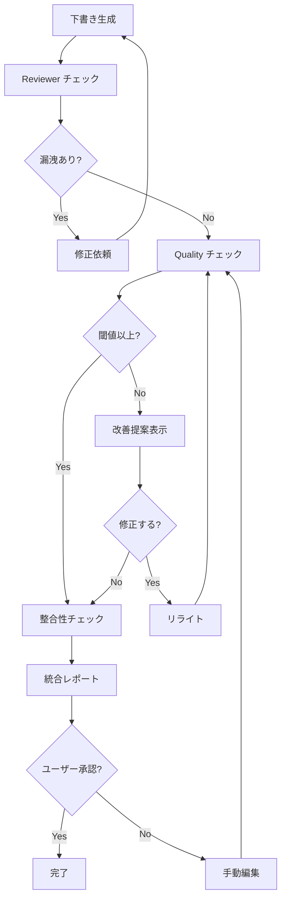

# 品質管理システム仕様書

## 1. 概要

### 1.1 目的

生成コンテンツの品質を自動評価し、人間の最終判断を支援する。

### 1.2 設計方針

| 方針 | 説明 |
|------|------|
| **ハイブリッド** | 自動スコアリング + 人間レビュー |
| **提案型** | 自動リトライではなく改善提案 |
| **閾値調整可能** | ユーザーが品質基準をカスタマイズ |

---

## 2. 品質スコアリング

### 2.1 評価指標

| 指標 | 説明 | 評価方法 | 閾値 |
|------|------|---------|------|
| **coherence_score** | シーン間の一貫性 | 文脈の連続性、遷移の自然さ | ≥ 0.6 |
| **pacing_score** | ペーシングの適切さ | シーン長のバランス、緩急 | ≥ 0.6 |
| **prose_score** | 文章品質 | 語彙多様性、文構造 | ≥ 0.65 |
| **character_score** | キャラクター描写 | 対話量、内面描写、行動一貫性 | ≥ 0.6 |
| **style_consistency** | 文体一貫性 | スタイルガイドとの整合 | ≥ 0.65 |
| **reader_excitement** | 読者の興奮・期待感 | 読者感情シミュレーション | ≥ 0.6 |
| **emotional_resonance** | 感情的共鳴 | キャラクター感情への共感度 | ≥ 0.6 |

### 2.2 スコア計算

```python
@dataclass
class QualityScore:
    coherence_score: float      # 0.0 - 1.0
    pacing_score: float
    prose_score: float
    character_score: float
    style_consistency: float
    reader_excitement: float    # 読者感情シミュレーション
    emotional_resonance: float  # 感情的共鳴

    @property
    def overall_score(self) -> float:
        weights = {
            'coherence': 0.20,
            'pacing': 0.12,
            'prose': 0.20,
            'character': 0.15,
            'style': 0.13,
            'excitement': 0.10,   # 読者の興奮・期待感
            'resonance': 0.10     # 感情的共鳴
        }
        return (
            self.coherence_score * weights['coherence'] +
            self.pacing_score * weights['pacing'] +
            self.prose_score * weights['prose'] +
            self.character_score * weights['character'] +
            self.style_consistency * weights['style'] +
            self.reader_excitement * weights['excitement'] +
            self.emotional_resonance * weights['resonance']
        )
```

### 2.3 品質閾値設定

**ファイルパス**: `vault/{作品名}/_settings/quality_thresholds.yaml`

```yaml
# 品質閾値設定
version: "1.0"

thresholds:
  # 各指標の最低基準
  minimum_coherence: 0.6
  minimum_pacing: 0.6
  minimum_prose: 0.65
  minimum_character: 0.6
  minimum_style: 0.65

  # 総合スコアの最低基準
  minimum_overall: 0.65

# 警告レベル
warning_levels:
  critical: 0.4    # このスコア以下は深刻な問題
  warning: 0.6     # このスコア以下は注意
  good: 0.75       # このスコア以上は良好

# リトライ設定
retry:
  enabled: false   # 自動リトライは無効（提案のみ）
  max_retries: 3   # Human Fallback までの最大リトライ回数

  # 条件付きリトライ（明確なルール違反のみ自動リトライ）
  conditional_retry:
    enabled: true
    auto_retry_conditions:
      - "forbidden_keyword"   # 禁止キーワード使用
      - "style_violation"     # スタイルガイド違反
    user_judgment_conditions:
      - "low_excitement"      # 面白くない（主観評価）
      - "pacing_issue"        # ペーシング問題

# 学習モード（初期は閾値を緩く）
learning_mode:
  enabled: true
  initial_threshold: 0.5     # 最初は0.5から開始
  target_threshold: 0.65     # 目標閾値
  increment_per_episode: 0.01 # エピソードごとの増加
  max_episodes_to_target: 15 # 目標到達までのエピソード数
```

---

## 3. 評価詳細

### 3.1 Coherence Score（一貫性スコア）

**評価項目**:
- 前シーンからの文脈の連続性
- 場面転換の自然さ
- 登場人物の行動の一貫性
- 時間軸の整合性

**低スコアの原因例**:
- 唐突な場面転換
- キャラクターの急な性格変化
- 説明不足の展開

### 3.2 Pacing Score（ペーシングスコア）

**評価項目**:
- シーン長のバランス
- 緊張と弛緩のリズム
- 情報開示のタイミング
- 読者の没入感維持

**低スコアの原因例**:
- 長すぎる説明パート
- 急ぎすぎる展開
- 単調なリズム

### 3.3 Prose Score（文章品質スコア）

**評価項目**:
- 語彙の豊富さ（TTR）
- 文の構造の多様性
- 不自然な表現の有無
- 冗長性の回避

**低スコアの原因例**:
- 同じ表現の繰り返し
- 文末パターンの単調さ
- AI特有の表現（「〜と言えるでしょう」等）

### 3.4 Character Score（キャラクタースコア）

**評価項目**:
- 対話の自然さ
- 内面描写の深さ
- 行動と性格の一致
- キャラクター間の関係性描写

**低スコアの原因例**:
- 説明的すぎる対話
- 性格に反する行動
- 関係性の不自然な変化

### 3.5 Style Consistency（文体一貫性スコア）

**評価項目**:
- スタイルガイドとの整合
- 視点の一貫性
- 時制の統一
- 語彙レベルの一貫性

**低スコアの原因例**:
- 視点のブレ
- 時制の混在
- 語彙レベルの不統一

### 3.6 Reader Excitement（読者興奮・期待感スコア）

**評価項目**:
- ページをめくらせる力（続きが気になるか）
- 緊張感の構築
- 謎や疑問の提示
- クリフハンガーの効果

**低スコアの原因例**:
- 予想通りの展開
- 緊張感の欠如
- 動機や目標の不明確さ
- 淡々とした情報伝達

**評価プロンプト例**:
```
初見の読者としてこのシーンを読んだとき:
- 「次はどうなるんだろう？」と思うか
- 読み進めたいという衝動があるか
- ハラハラ、ワクワク、ドキドキする瞬間があるか
```

### 3.7 Emotional Resonance（感情的共鳴スコア）

**評価項目**:
- キャラクターへの感情移入
- 感情の自然な描写
- 読者の感情を動かす力
- カタルシスの有無

**低スコアの原因例**:
- 感情描写が説明的すぎる
- キャラクターの反応が不自然
- 感情の起伏がない
- 共感できない動機

**評価プロンプト例**:
```
読者として:
- キャラクターの感情に共感できるか
- 喜び、悲しみ、怒りなどを一緒に感じられるか
- 感情的に揺さぶられる瞬間があるか
```

---

## 4. 品質レポート

### 4.1 レポート構造

```yaml
quality_report:
  episode: "EP-010"
  timestamp: "2026-01-24T10:30:00"

  scores:
    coherence: 0.72
    pacing: 0.65
    prose: 0.78
    character: 0.70
    style: 0.75
    overall: 0.72

  assessment: "good"  # critical | warning | good | excellent

  issues:
    - category: "pacing"
      severity: "warning"
      location: "第3段落〜第5段落"
      description: "説明が長く、テンポが落ちています"
      suggestion: "対話や行動で情報を伝えることを検討してください"

    - category: "character"
      severity: "warning"
      location: "第8段落"
      description: "主人公の反応がやや唐突です"
      suggestion: "内面描写を追加して動機を明確にしてください"

  strengths:
    - "キャラクター間の対話が自然です"
    - "文体がスタイルガイドと一致しています"
    - "場面描写が鮮明です"

  recommendations:
    - priority: "high"
      action: "第3-5段落を対話形式にリライト"
      # 具体的な改善例を提供（Few-shot prompting）
      example_rewrite: |
        【現状】
        彼女は魔法の詠唱方法について長々と説明を受けた。

        【改善案】
        「まず、手のひらを上に向けて」師匠が彼女の手を取った。
        「それから？」
        「力を込めすぎるな。水が流れるように、自然に」
    - priority: "medium"
      action: "第8段落に主人公の心理描写を追加"
      example_rewrite: |
        【現状】
        彼女は剣を抜いた。

        【改善案】
        心臓が早鐘を打つ。握った柄が汗で滑りそうだった。
        それでも——彼女は剣を抜いた。
```

### 4.2 レポート表示例

```
┌─────────────────────────────────────────────────────────────┐
│ 品質レポート: EP-010                                         │
├─────────────────────────────────────────────────────────────┤
│ 総合評価: ★★★☆☆ (0.72 - Good)                              │
├─────────────────────────────────────────────────────────────┤
│ 詳細スコア:                                                  │
│   一貫性:     ████████░░ 0.72                               │
│   ペーシング: ██████░░░░ 0.65 ⚠️                            │
│   文章品質:   ████████░░ 0.78                               │
│   キャラ:     ███████░░░ 0.70                               │
│   文体:       ████████░░ 0.75                               │
├─────────────────────────────────────────────────────────────┤
│ ⚠️ 改善提案 (2件):                                          │
│   [高] 第3-5段落のテンポ改善                                 │
│   [中] 第8段落の心理描写追加                                 │
├─────────────────────────────────────────────────────────────┤
│ ✓ 強み:                                                     │
│   - 自然な対話                                               │
│   - 文体の一貫性                                             │
│   - 鮮明な描写                                               │
└─────────────────────────────────────────────────────────────┘
```

---

## 5. 整合性チェック

### 5.1 チェック項目

| カテゴリ | チェック内容 |
|---------|------------|
| **キャラクター** | 性格、能力、関係性の矛盾 |
| **世界観** | 設定、ルール、歴史の矛盾 |
| **時系列** | イベントの順序、経過時間 |
| **伏線** | 設置/回収の整合性 |
| **フェーズ** | キャラクター状態とフェーズの整合 |

### 5.2 AoT 並列チェック

```
整合性チェック (AoT 並列)
├── Atom A: キャラクター整合 → 独立
├── Atom B: 世界観整合     → 独立
├── Atom C: 時系列整合     → 独立
├── Atom D: 伏線整合       → 独立
└── Atom E: フェーズ整合   → 独立

※ 各Atomは完全独立、並列実行可能
※ 1Atomの失敗は他Atomに影響しない
```

### 5.3 整合性レポート

```yaml
consistency_report:
  episode: "EP-010"

  checks:
    character:
      status: "pass"
      issues: []

    world:
      status: "warning"
      issues:
        - type: "rule_violation"
          detail: "魔法の発動条件が以前と異なっています"
          reference: "EP-003"

    timeline:
      status: "pass"
      issues: []

    foreshadowing:
      status: "pass"
      issues: []

    phase:
      status: "pass"
      issues: []

  summary:
    passed: 4
    warnings: 1
    errors: 0
```

---

## 6. Reviewer Agent との連携

### 6.1 処理順序

```
下書き生成
    ↓
Reviewer Agent（情報漏洩チェック）
    ↓
Quality Agent（品質チェック）
    ↓
整合性チェック
    ↓
統合レポート → ユーザー判断
```

### 6.2 統合レポート

```yaml
integrated_report:
  episode: "EP-010"

  reviewer_result:
    status: "approved"
    leakage_issues: []

  quality_result:
    overall: 0.72
    assessment: "good"
    issues: 2

  consistency_result:
    passed: 4
    warnings: 1
    errors: 0

  recommendation: "軽微な修正で完成可能"
```

---

## 7. ワークフロー統合

### 7.1 品質ゲート



### 7.2 人間判断ポイント

| ポイント | 判断内容 |
|---------|---------|
| 改善提案後 | 修正するか、そのまま進むか |
| 統合レポート後 | 承認するか、手動編集するか |
| 整合性警告後 | 無視するか、修正するか |
