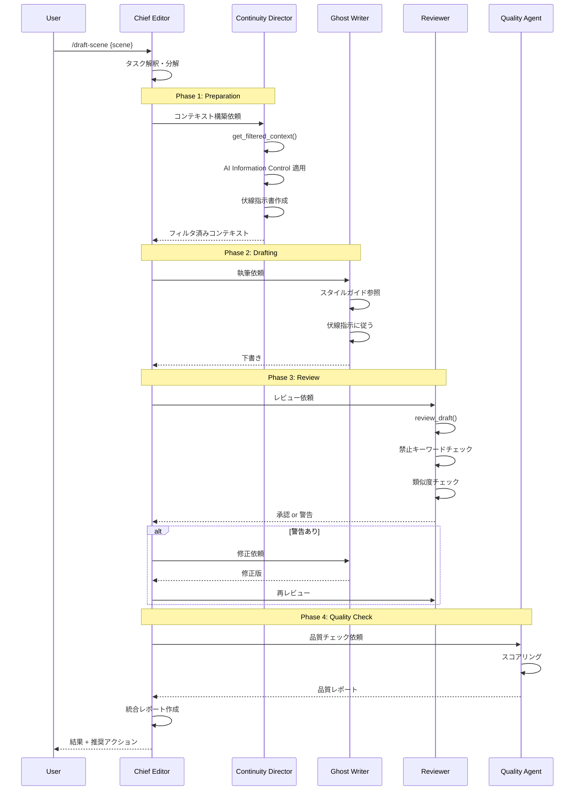
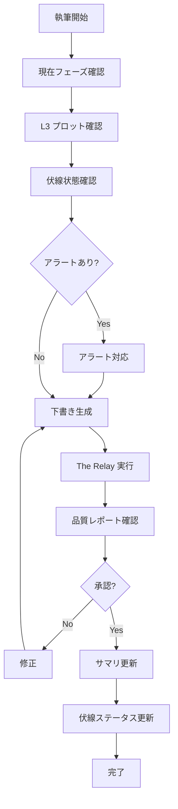
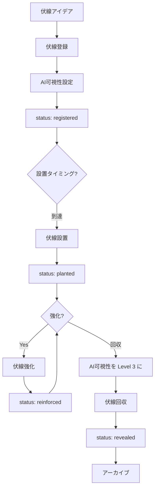

# ワークフロー設計書

## 1. 概要

### 1.1 設計方針

| 方針 | 説明 | 採用元 |
|------|------|--------|
| **Phase-Gate-Approval** | 承認ゲートによる品質担保 | Novel-Athanor |
| **The Relay** | エージェント間の協調ワークフロー | Antigravity |
| **ハイブリッド** | 自動化 + 人間判断 | 統合 |

### 1.2 フェーズ構成

```
PLANNING → BUILDING → AUDITING → 完了
   ↓          ↓          ↓
 要件定義    TDD実装    レビュー
 設計       テスト     監査
 タスク分解
```

---

## 2. The Relay ワークフロー

### 2.1 概要

エージェント間でタスクをリレーのように受け渡す協調ワークフロー。

```
Chief Editor → Continuity Director → Ghost Writer → Reviewer → Quality Agent
    ↓              ↓                    ↓            ↓           ↓
  統括          コンテキスト          執筆        漏洩チェック   品質評価
               フィルタリング
```

### 2.2 詳細フロー（下書き生成）



### 2.3 必須ツール呼び出し

The Relay では、特定のツールの呼び出しが必須化されている。

| ツール | 呼び出し元 | 説明 |
|--------|-----------|------|
| `get_filtered_context()` | Continuity Director | コンテキスト構築（スキップ不可） |
| `review_draft()` | Reviewer | 漏洩チェック（スキップ不可） |

**目的**: ツール必須化により、情報フィルタリングと漏洩チェックを確実に実行する。

---

## 3. Phase-Gate-Approval モデル

### 3.1 概要

```
サブフェーズ → [成果物] → [承認] → 次のサブフェーズ
```

### 3.2 PLANNING フェーズ

```
requirements → [承認] → design → [承認] → tasks → [承認] → BUILDING
     ↓                    ↓                 ↓
  要件定義書            設計書           タスクリスト
```

**ガードレール**:
- 実装コードの生成禁止
- `src/` への変更禁止
- 未承認での進行禁止

### 3.3 BUILDING フェーズ

```
test → [Red] → implement → [Green] → refactor → [承認] → 次のタスク
  ↓              ↓              ↓
失敗テスト     最小実装      リファクタ
```

**ガードレール**:
- 仕様書の事前確認必須
- TDDサイクル厳守
- ドキュメント同期必須

### 3.4 AUDITING フェーズ

```
review → [レポート] → [承認] → 完了
   ↓
品質監査
```

**ガードレール**:
- 直接修正禁止（指摘のみ）
- チェックリストに基づく監査
- 重要度分類必須

---

## 4. 状態管理

### 4.1 状態ファイル

**ファイルパス**: `.claude/states/{feature}.json`

```json
{
  "feature": "draft-scene-ep010",
  "phase": "BUILDING",
  "subphase": "review",
  "started_at": "2026-01-24T10:00:00",
  "updated_at": "2026-01-24T10:30:00",
  "approvals": [
    {
      "gate": "requirements",
      "approved_at": "2026-01-24T10:05:00"
    },
    {
      "gate": "design",
      "approved_at": "2026-01-24T10:15:00"
    }
  ],
  "current_step": "quality_check",
  "relay_state": {
    "continuity_director": "completed",
    "ghost_writer": "completed",
    "reviewer": "completed",
    "quality_agent": "in_progress"
  }
}
```

### 4.2 現在フェーズ

**ファイルパス**: `.claude/current-phase.md`

```markdown
# 現在のフェーズ

**フェーズ**: BUILDING
**サブフェーズ**: implementation
**更新日時**: 2026-01-24 10:30
```

---

## 5. 創作ワークフロー

### 5.1 新作開始フロー

```mermaid
graph TD
    A[/planning] --> B[L1 プロット作成]
    B --> C{承認?}
    C -->|No| B
    C -->|Yes| D[キャラクター設定作成]
    D --> E[世界観設定作成]
    E --> F[伏線登録]
    F --> G[AI可視性設定]
    G --> H[L2 プロット作成]
    H --> I{承認?}
    I -->|No| H
    I -->|Yes| J[L3 プロット作成]
    J --> K{承認?}
    K -->|No| J
    K -->|Yes| L[/building]
    L --> M[第1話下書き生成]
```

### 5.2 連載継続フロー



### 5.3 伏線管理フロー



---

## 6. コマンドマッピング

### 6.1 単一エントリーポイント

覚えやすさのため、`/athanor` という単一エントリーポイントを提供し、サブコマンド形式で機能を呼び出す。

| コマンド | エイリアス | 実行内容 |
|---------|-----------|---------|
| `/athanor draft` | `/draft-scene` | The Relay 実行 |
| `/athanor status` | `/foreshadowing-status` | 伏線ダッシュボード表示 |
| `/athanor quality` | `/quality-report` | 品質レポート生成 |
| `/athanor resume` | `/resume` | 中断状態から再開 |
| `/athanor rollback` | - | チェックポイント復旧 |
| `/athanor switch {作品名}` | - | 作品切替 |

### 6.2 フェーズ管理コマンド

| コマンド | フェーズ | 実行内容 |
|---------|---------|---------|
| `/planning` | PLANNING開始 | フェーズ切替、ガードレール適用 |
| `/building` | BUILDING開始 | フェーズ切替、ガードレール適用 |
| `/auditing` | AUDITING開始 | フェーズ切替、ガードレール適用 |

### 6.3 機能コマンド

| コマンド | フェーズ | 実行内容 |
|---------|---------|---------|
| `/draft-scene` | BUILDING | The Relay 実行 |
| `/check-consistency` | AUDITING | 整合性チェック |
| `/foreshadowing-status` | Any | 伏線ダッシュボード表示 |
| `/quality-report` | BUILDING/AUDITING | 品質レポート生成 |
| `/resume` | Any | 中断状態から再開 |

### 6.4 /resume コマンド

`.claude/states/` に保存された中間状態からセッションを再開する。

```bash
/resume
# または
/athanor resume

# 出力例:
# 中断状態が見つかりました:
#   - draft-scene-ep010: quality_check 段階で中断
#   - 最終更新: 2026-01-24 10:30
#
# 再開しますか? (y/n)
```

```python
def resume_from_state():
    """中断状態からの再開"""
    states = load_all_states()
    incomplete = [s for s in states if s['status'] != 'completed']

    if not incomplete:
        return "中断状態はありません"

    # 最新の中断状態を表示
    latest = max(incomplete, key=lambda s: s['updated_at'])
    return {
        'feature': latest['feature'],
        'phase': latest['phase'],
        'current_step': latest['current_step'],
        'relay_state': latest['relay_state']
    }
```

---

## 7. エラーハンドリング

### 7.1 The Relay でのエラー

| エラー発生箇所 | 対応 |
|--------------|------|
| Continuity Director | コンテキスト構築失敗 → ユーザーに報告、手動対応 |
| Ghost Writer | 生成失敗 → リトライ（最大3回）→ ユーザーに報告 |
| Reviewer | 漏洩検出 → 警告表示、修正依頼 |
| Quality Agent | 低スコア → 改善提案表示、ユーザー判断 |

### 7.2 状態復旧

```
1. 最後の成功状態を .claude/states/ から復元
2. 失敗したステップから再開
3. 必要に応じて手動介入
```

### 7.3 データ破損復旧

作業データが破損した場合、Gitの自動コミットからリセットする。

**自動コミット**: 作業開始時に自動的にコミットを作成する。

```python
def auto_checkpoint_on_start():
    """作業開始時の自動チェックポイント"""
    if has_uncommitted_changes():
        commit_message = f"[auto] checkpoint before {current_task}"
        git_commit(commit_message)

    return get_current_commit_hash()
```

**復旧コマンド**:

```bash
# 直前のチェックポイントへリセット
/athanor rollback

# 出力例:
# 直前のチェックポイントが見つかりました:
#   - コミット: abc1234
#   - 日時: 2026-01-24 10:00
#   - メッセージ: [auto] checkpoint before draft-scene-ep010
#
# このコミットにリセットしますか? (y/n)
```

```python
def rollback_to_checkpoint():
    """チェックポイントへのロールバック"""
    checkpoints = get_auto_checkpoints()

    if not checkpoints:
        return "チェックポイントが見つかりません"

    latest = checkpoints[-1]
    git_reset_hard(latest['commit_hash'])

    return f"コミット {latest['commit_hash'][:7]} にリセットしました"
```

### 7.4 競合解決

複数人での共同作業時の競合は Git に任せる。ファイルロック機構は自前実装しない。

```
競合発生時:
1. git pull でリモート変更を取得
2. 競合が発生したら git diff で確認
3. 手動でマージ解決
4. コミット
```

---

## 8. 並列処理

### 8.1 AoT 並列コンテキスト収集

```
Continuity Director 内での並列処理:

Atom 1: Plot L1     ─┐
Atom 2: Plot L2     ─┤
Atom 3: Plot L3     ─┼─→ 統合 → フィルタ済みコンテキスト
Atom 4: Summary     ─┤
Atom 5: Characters  ─┤
Atom 6: WorldSetting─┤
Atom 7: StyleGuide  ─┤
Atom 8: Foreshadow  ─┘
```

### 8.2 AoT 並列整合性チェック

```
整合性チェック内での並列処理:

Atom A: キャラクター整合 ─┐
Atom B: 世界観整合       ─┤
Atom C: 時系列整合       ─┼─→ 統合 → 整合性レポート
Atom D: 伏線整合         ─┤
Atom E: フェーズ整合     ─┘
```
