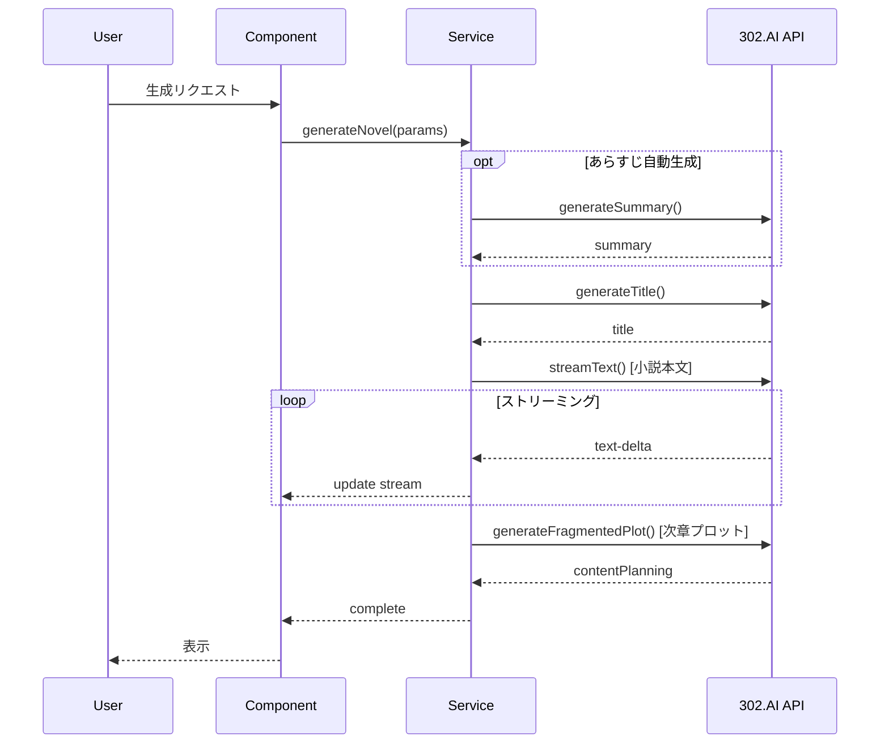

# 302_novel_writing 解析レポート

**Phase 3**: Web UI/プロンプト設計分析
**解析日**: 2026-01-24
**対象**: `docs/302_novel_writing-main/`

---

## 1. システム概要

302_novel_writingは**Webベースの小説執筆支援ツール**で、302.AI社が提供するSaaS型AIプラットフォームのオープンソース版。AIによる章生成、プロット計画、キャラクター管理機能を持つ。

### 1.1 ポジショニング比較

| 観点 | 302_novel_writing | Novel-Athanor | NovelWriter |
|------|-------------------|---------------|-------------|
| **プラットフォーム** | Web (Next.js) | CLI (Claude Code) | Desktop (Python/Tkinter) |
| **自動化レベル** | 対話的・AI支援 | 対話的・人間主導 | 全自動バッチ |
| **ターゲット** | 一般ユーザー | 創作者（中上級） | 開発者・自動化 |
| **設定管理** | シンプル | 詳細（L1/L2/L3） | 中程度 |
| **多言語** | 中/英/日 | 日本語 | 英語 |

### 1.2 技術スタック

```
Next.js 14
├── TypeScript
├── TailwindCSS + Radix UI
├── Jotai（状態管理）
├── React Hook Form
├── ky（HTTPクライアント）
├── next-intl（i18n）
└── IndexedDB（ローカルストレージ）
```

---

## 2. アーキテクチャ

### 2.1 ディレクトリ構造

```
src/
├── api/                    # API層
│   ├── auth.ts             # 認証
│   ├── chat.ts             # AIチャット
│   └── upload.ts           # ファイルアップロード
├── app/[locale]/[id]/      # 作品編集ページ
│   └── components/
│       ├── leftMenu/       # 左メニュー（目次）
│       │   └── catalogue/
│       └── rightMenu/      # 右メニュー（AI執筆）
│           ├── AIWriting/  # AI執筆機能
│           └── wordCount/  # 文字数カウント
├── components/             # 共通コンポーネント
├── constants/              # 定数
│   └── novelStyleType/     # 小説スタイル別設定
├── hooks/                  # カスタムフック
├── stores/                 # Jotaiストア
│   └── slices/
│       ├── catalogue_store.ts
│       ├── chat_store.ts
│       └── config_store.ts
└── utils/                  # ユーティリティ
```

### 2.2 データフロー

```
┌─────────────┐     ┌─────────────┐     ┌─────────────┐
│   IndexedDB │ ←── │   Jotai     │ ←── │  Next.js    │
│  (ローカル) │     │  (状態管理) │     │  (API Route)│
└─────────────┘     └─────────────┘     └─────────────┘
                           ↑                   ↑
                           │                   │
                    ┌──────┴───────┐     ┌─────┴─────┐
                    │ React Components│  │ 302.AI API│
                    └──────────────────┘  └───────────┘
```

---

## 3. データモデル

### 3.1 コアエンティティ

```typescript
// 章
interface IChapter {
  id?: number;
  name: string;
  content: string;
  parentId: number;
  updatedAt: string;
}

// 下書き
interface IDraft {
  id?: number;
  parentId: number;
  name: string;
  content: string;
  updatedAt: string;
}

// キャラクター
interface ICharacter {
  id?: number;
  name: string;
  content: string;      // 詳細説明
  parentId: number;
  labelColor: string;
}

// 設定
interface ISetting {
  id?: number;
  parentId: number;
  storyBackground: string;
  outline: {
    id: string;
    content: string;
    mindMap: string;
    createdAt: string;
  }[];
  writingStyle: {
    value: string;
    customize: string;
  };
  character: ICharacter[];
  inspiration: IInspiration[];
}

// インスピレーション
interface IInspiration {
  id: string;
  content: string;
  time: string;
}
```

### 3.2 設定・UI関連

```typescript
// ページレイアウト
interface IPageLayout {
  titleTextAlign: 'left' | 'center' | 'right';
  editorSize: 640 | 800 | 1280;
  letterSpacing: number;
  lineHeight: number;
  sideMargin: number;
  bottomSpacing: number;
}

// その他設定
interface IMoreSettings {
  enableFirstLineIndent: boolean;
  enableParagraphSpacing: boolean;
  ignorePunctuation: boolean;
  scrollToBottomOnOpen: boolean;
}

// フォント
interface IFont {
  font: string;
  fontSize: string;
  textColor: string;
  bold: boolean;
  italic: boolean;
  underline: boolean;
}
```

---

## 4. AI生成機能

### 4.1 生成フロー



### 4.2 生成パラメータ

```typescript
interface IFrom {
  synopsis: string;             // あらすじ選択
  synopsisCustomize: string;    // カスタムあらすじ
  backgroundStory: string;      // 背景設定
  writingStyle: string;         // 文体スタイル
  writingStyleCustomize: string;// カスタム文体
  fragmentedPlot: string;       // 章プロット
  writingRequirements: string;  // 執筆要件
  previousClip: string;         // 前章参照
  previousClipCustomize: string;// カスタム前章
  characterRelationships: string;// キャラクター関係
  introduction: string;         // 作品紹介
  chapterCount: number;         // 総章数
  chapterOrder: number;         // 現在章番号
}
```

---

## 5. プロンプト設計

### 5.1 小説生成プロンプト（日本語版）

```
あなたは専門の小説執筆アシスタントです。以下の情報に基づいて新規な章の内容を生成してください。

入力情報：
1.必須項目：
-作風：[都市の日常生活/古代ロマン/ファンタジー小説/その他]
-フラグメントストーリー：[この章の主なイベントの概要]
-ライティング要件：[文字数制限/視点要件/特定のライティングスキル]

2.オプション項目：
-合計章節数：[計画の合計章節数]
-現在の章番号：[何章]
-ストーリーの事前情報の概要：[前章のキーポイント]
-ストーリーの背景：[ワールド背景]
-キャラクター：[キャラクターの説明]
-前のセッション：[前の章の完全な本文内容]

作成要件：
1.内容基準：
-指定された作風に厳密に従う
-ストーリーの一貫性を確保
-性格特徴と一致
-ワールド設定との整合性を維持

2.書く技術：
-スタイルに合わせて適切な叙事リズムを選択
-会話、説明、心理活動を正しく利用する
-シーンの細部と雰囲気を重視

3.構造要件：
-章の冒頭は前の章と自然に接続
-末尾には将来の発展の余地を適切に残す

4.品質管理：
-論理的脆弱性の回避
-リアルで自然な性格の会話を確保する
-形容詞や副詞の過度な使用を避ける
```

### 5.2 プロット計画プロンプト

```
提供された内容に基づいて小説の新しい章のシナリオ計画を生成してください。

1.必須内容：小説の紹介
2.選択内容：総章数、現在の章番号、物語背景、人物、前章本文、前件概要

章の要求：
-第1章：小説のあらすじに基づいてストーリー計画を生成
-第2章以上：前文との一貫性を維持

出力要求：
-3～4つのストーリーポイントを分点的に羅列
-文は簡単で率直
-1つのコアストーリーと関連する詳細な描写を含む
```

### 5.3 キャラクター抽出プロンプト

```xml
<prompt>
  <task>根据章节内容提取新的人物角色名，并总结出人物描述</task>

  <requirements>
    <requirement>在章节内容中，先排除已有角色名，然后提取新出现的人物角色名</requirement>
    <requirement>参考已有角色的描述风格和深度，总结新角色的特征描述</requirement>
    <requirement>人物描述需全面涵盖：性格特点、背景信息、外貌特征(如有)、人物关系、动机行为等</requirement>
  </requirements>

  <extraction_guidelines>
    <guideline>识别章节中出现的所有人名</guideline>
    <guideline>排除与已有角色名完全相同的名字</guideline>
    <guideline>注意处理昵称、别名、职位称呼等</guideline>
  </extraction_guidelines>

  <output_format>
    <character>
      <name>角色名</name>
      <description>详细描述</description>
    </character>
  </output_format>
</prompt>
```

---

## 6. 小説スタイルテンプレート

### 6.1 対応スタイル

| カテゴリ | 日本語 | サンプル数 |
|---------|--------|-----------|
| Ancient History | 古代歴史 | 5 |
| Ancient Romance | 古代ロマンス | 5 |
| Ancient Time Travel | 古代タイムトラベル | 5 |
| Fantasy Romance | ファンタジーロマンス | 5 |
| Game Anime | ゲームアニメ | 5 |
| Illusory Fictional | 幻想小説 | 5 |
| Modern Romance | 現代ロマンス | 5 |
| Suspense Brain Hole | サスペンス | 5 |
| Zhihu Short Story | 知乎短編 | 5 |

### 6.2 スタイル適用方式

ユーザーがスタイルを選択すると、対応するサンプルテキストが`writingStyleCustomize`に設定され、プロンプトに含まれる。

---

## 7. 特徴的な機能

### 7.1 ストリーミング生成

```typescript
const { fullStream } = streamText({
  model: model.chatModel(modelName),
  messages: [
    { role: 'system', content: generateNovelprompt[lang] },
    { role: 'user', content }
  ],
});

for await (const chunk of fullStream) {
  if (chunk.type === 'text-delta') {
    stream.update({ type: 'text-delta', textDelta: text })
  }
}
```

### 7.2 章連携機能

- **前章参照**: 最後の1300文字を次章生成の参考に
- **あらすじ自動生成**: 既存コンテンツから要約を生成
- **次章プロット提案**: 生成完了後に次章のプロット案を提示

### 7.3 キャラクター自動抽出

生成された章から新しいキャラクターを自動検出し、既存キャラクターリストと照合して追加。

---

## 8. 新システムへの示唆

### 8.1 採用すべき要素

1. **多言語プロンプト設計**: 言語別に最適化されたプロンプト
2. **ストリーミングUI**: リアルタイム生成表示
3. **スタイルテンプレート**: サンプルベースの文体指定
4. **キャラクター自動抽出**: 生成コンテンツからのメタデータ抽出
5. **章連携機構**: 前章との文脈維持

### 8.2 採用しない要素

1. **Webベースアーキテクチャ**: CLI/Obsidianベースを維持
2. **単純なデータモデル**: L1/L2/L3階層を採用
3. **外部API依存**: Claude Code統合を維持

### 8.3 改善が必要な点

1. **伏線管理の欠如**: プロットスレッド概念なし
2. **AI情報制御の欠如**: 設定の可視性制御なし
3. **品質評価の欠如**: 自動スコアリングなし
4. **整合性チェックの欠如**: 自動検証なし

---

## 9. 3システム比較サマリー

| 機能 | Novel-Athanor | NovelWriter | 302_novel_writing | 新システム方針 |
|-----|--------------|-------------|-------------------|---------------|
| **プラットフォーム** | CLI/Obsidian | Desktop/Tkinter | Web/Next.js | CLI/Obsidian |
| **自動化レベル** | 低（人間主導） | 高（全自動） | 中（AI支援） | 中（ハイブリッド） |
| **L1/L2/L3階層** | ○ | × | × | ○（採用） |
| **伏線管理** | △（部分的） | × | × | ◎（新規設計） |
| **AI情報制御** | △（隠し設定） | × | × | ◎（新規設計） |
| **フェーズ管理** | ○ | × | × | ○（採用） |
| **品質管理** | × | ○ | × | ○（採用） |
| **整合性追跡** | × | ○ | × | ○（採用） |
| **多言語プロンプト** | × | × | ○ | △（日本語優先） |
| **スタイルテンプレート** | △ | ○ | ○ | ○（採用） |

---

## 10. 次のステップ

- **Phase 3.5**: Antigravity（要追加調査）
- **Phase 3.9**: クロスレビュー統合
- **Phase 4**: 新システム設計
