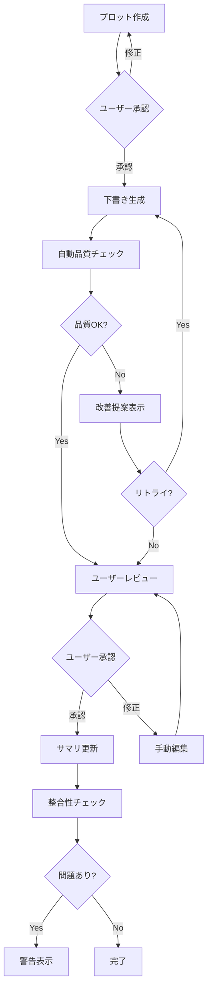

# クロスレビュー統合レポート

**Phase 3.9**: 3システム横断分析と新システム設計指針
**作成日**: 2026-01-24

---

## 1. 解析サマリー

### 1.1 対象システム

| システム | 特徴 | 強み | 弱み |
|---------|------|------|------|
| **Novel-Athanor** | CLI/Obsidian統合、対話的 | L1/L2/L3階層、フェーズ管理、人間主導 | 品質管理自動化なし、整合性追跡弱い |
| **NovelWriter** | Python/GUI、全自動 | マルチエージェント、品質スコアリング、整合性追跡 | 人間介入困難、伏線概念なし |
| **302_novel_writing** | Web/Next.js、AI支援 | 多言語プロンプト、ストリーミングUI、スタイルテンプレート | 単純なデータモデル、検証機能なし |

### 1.2 解析で発見した重要な要件

**ユーザーフィードバックより（最重要）**:
> 「隠し設定とかに関しては読者に対する隠しもあるけれども、AIがそれを知ったことによって文章に混ぜてしまうことを一番恐れている」

これにより**AI情報制御**が新システムの核心要件として特定された。

---

## 2. 機能別ベストプラクティス

### 2.1 データモデル

```
推奨: Novel-Athanor の L1/L2/L3 階層 + NovelWriter の整合性追跡
```

| 機能 | 採用元 | 理由 |
|-----|-------|------|
| **Plot L1/L2/L3** | Novel-Athanor | 計画の粒度制御に優れる |
| **Summary L1/L2/L3** | Novel-Athanor | 実績の階層管理に優れる |
| **Phase管理** | Novel-Athanor | キャラクター/世界観の時系列管理 |
| **CharacterState** | NovelWriter | 動的な状態追跡 |
| **WorldElement** | NovelWriter | 世界観要素の参照管理 |
| **PlotThread** | NovelWriter | プロットスレッド追跡（伏線管理の基礎） |

### 2.2 エージェントアーキテクチャ

```
推奨: NovelWriter のマルチエージェント設計（簡略化）
```

| エージェント | 機能 | 採用度 |
|------------|------|--------|
| **QualityControlAgent** | 品質評価 | 採用（簡略化） |
| **ConsistencyAgent** | 整合性チェック | 採用 |
| **DraftSceneAgent** | 下書き生成 | 採用（Novel-Athanor方式） |
| **ReviewAgent** | レビュー&リトライ | 採用 |
| **AdaptivePlanningAgent** | アーク分析 | 不採用（過剰） |

### 2.3 品質管理

```
推奨: NovelWriter のスコアリング + 人間レビュー
```

| 機能 | 採用 | 詳細 |
|-----|------|------|
| **自動スコアリング** | ○ | coherence, pacing, prose |
| **閾値ベースリトライ** | △ | 提案のみ（自動リトライなし） |
| **3段階レビュー** | △ | Scene→Chapter（Batchは不要） |
| **人間最終判断** | ○ | Novel-Athanor方式維持 |

### 2.4 プロンプト設計

```
推奨: 302_novel_writing の構造化プロンプト
```

| 要素 | 採用 | 詳細 |
|-----|------|------|
| **多言語対応** | △ | 日本語優先（必要時に拡張） |
| **構造化入力** | ○ | 必須/オプション分離 |
| **品質管理ルール** | ○ | プロンプト内に明記 |
| **スタイルテンプレート** | ○ | サンプルベース文体指定 |

---

## 3. 新システム核心設計

### 3.1 AI情報制御システム（新規）

**4段階可視性レベル**:

```yaml
# 伏線エンティティ例
id: FS-001
title: 主人公の出生の秘密
content: "主人公は実は王族の血筋である"
ai_visibility:
  level: 2  # 内容認識（文章には出さない）
  allowed_expressions:
    - "匂わせ"
    - "暗示"
  forbidden_expressions:
    - "王族"
    - "血筋"
    - "高貴"
```

| Level | 名称 | AIの認識 | AIの行動 |
|-------|------|---------|---------|
| 0 | 完全秘匿 | 存在すら知らない | 何も書けない |
| 1 | 認識のみ | 「何かある」と知る | 内容には触れない |
| 2 | 内容認識 | 内容を知っている | 文章には出さない |
| 3 | 使用可能 | 完全に把握 | 文章で使ってよい |

**表現制御**:
- 禁止キーワードリスト
- 設定文直接引用禁止
- 類似度チェック

**段階的開示**:
```
伏線登録時: Level 0
    ↓
伏線を張る: Level 1-2
    ↓
回収予告: Level 2
    ↓
伏線回収: Level 3
```

### 3.2 伏線管理システム（新規）

Novel-Athanorの部分的実装 + NovelWriterのPlotThread を統合・拡張:

```yaml
# 伏線エンティティ
foreshadowing:
  id: FS-001
  title: "主人公の出生の秘密"
  type: "character_secret"  # character_secret, plot_twist, world_reveal
  status: "planted"  # registered, planted, reinforced, revealed

  # AI情報制御
  ai_visibility:
    level: 2
    forbidden_expressions: ["王族", "血筋"]

  # 時系列管理
  timeline:
    registered_at: "2026-01-20"
    planted_at:
      - episode: "EP003"
        type: "hint"
        expression: "彼の瞳には見覚えのある光があった"
    reinforced_at:
      - episode: "EP008"
        type: "foreshadow"
    revealed_at: null

  # 関連要素
  related:
    characters: ["主人公", "国王"]
    plot_threads: ["PT-003"]
    episodes: ["EP003", "EP008"]
```

### 3.3 ハイブリッドワークフロー

Novel-Athanorの対話性 + NovelWriterの検証:



---

## 4. アーキテクチャ設計

### 4.1 コンポーネント構成

```
Auto-Novel-Athanor/
├── .claude/
│   ├── agents/                 # エージェント定義
│   │   ├── draft-scene.md      # 下書き生成
│   │   ├── quality-check.md    # 品質チェック
│   │   ├── consistency-check.md# 整合性チェック
│   │   └── extract-*.md        # 設定抽出系
│   ├── skills/                 # 知識ベース
│   │   ├── plot-theories/
│   │   ├── character-theories/
│   │   ├── style-guidelines/
│   │   └── foreshadowing-rules/ # 新規
│   └── commands/               # スラッシュコマンド
│
├── vault/
│   └── {作品名}/
│       ├── episodes/
│       ├── characters/
│       ├── world/
│       ├── _plot/              # L1/L2/L3
│       ├── _summary/           # L1/L2/L3
│       ├── _foreshadowing/     # 新規: 伏線管理
│       │   ├── registry.yaml   # 伏線登録簿
│       │   └── timeline.yaml   # 伏線タイムライン
│       └── _ai_control/        # 新規: AI制御
│           └── visibility.yaml # 可視性設定
│
└── docs/
    └── internal/               # SSOT
```

### 4.2 データフロー

```
┌─────────────────────────────────────────────────────────────┐
│                      Claude Code CLI                         │
├─────────────────────────────────────────────────────────────┤
│                                                              │
│  ┌──────────────┐    ┌──────────────┐    ┌──────────────┐  │
│  │   Skills     │    │   Agents     │    │  Commands    │  │
│  │  (知識ベース)  │◄──│  (処理実行)   │◄──│ (ユーザーI/F) │  │
│  └──────────────┘    └──────────────┘    └──────────────┘  │
│         │                   │                   │           │
│         ▼                   ▼                   ▼           │
│  ┌────────────────────────────────────────────────────────┐ │
│  │                    AI Control Layer                     │ │
│  │  ┌─────────────┐  ┌─────────────┐  ┌─────────────────┐ │ │
│  │  │ Visibility  │  │ Expression  │  │ Foreshadowing   │ │ │
│  │  │ Controller  │  │ Filter      │  │ Manager         │ │ │
│  │  └─────────────┘  └─────────────┘  └─────────────────┘ │ │
│  └────────────────────────────────────────────────────────┘ │
│         │                   │                   │           │
│         ▼                   ▼                   ▼           │
│  ┌────────────────────────────────────────────────────────┐ │
│  │                   Vault (Obsidian)                      │ │
│  │  ┌─────────┐  ┌─────────┐  ┌─────────┐  ┌───────────┐ │ │
│  │  │ Episodes│  │ Settings│  │ Plot/Sum│  │Foreshadow │ │ │
│  │  └─────────┘  └─────────┘  └─────────┘  └───────────┘ │ │
│  └────────────────────────────────────────────────────────┘ │
│                                                              │
└─────────────────────────────────────────────────────────────┘
```

---

## 5. 実装優先順位

### 5.1 Phase 4 サブフェーズ

| Phase | 内容 | 優先度 |
|-------|------|--------|
| 4.1 | AI情報制御システム設計 | 最高 |
| 4.2 | 伏線管理システム設計 | 高 |
| 4.3 | 品質管理システム設計 | 中 |
| 4.4 | 整合性追跡システム設計 | 中 |
| 4.5 | データモデル統合設計 | 中 |
| 4.6 | エージェント設計 | 低 |

### 5.2 リスク要因

| リスク | 影響 | 対策 |
|-------|------|------|
| AI情報制御の複雑性 | 高 | 段階的実装、Level 2から開始 |
| 既存Novel-Athanorとの互換性 | 中 | マイグレーションパス設計 |
| 品質スコアリングの精度 | 中 | 人間レビュー併用 |
| プロンプト肥大化 | 低 | モジュール化、動的構築 |

---

## 6. 結論

### 6.1 新システムの方向性

1. **Novel-Athanorベース**: L1/L2/L3、フェーズ管理、人間主導の対話性を維持
2. **NovelWriterから導入**: 品質スコアリング、整合性追跡、マルチエージェント（簡略版）
3. **302_novel_writingから導入**: 構造化プロンプト、スタイルテンプレート
4. **新規開発**: AI情報制御、伏線管理システム

### 6.2 差別化ポイント

- **AI情報制御**: 他システムにない独自機能
- **伏線管理**: 創作支援ツールとして本格的な伏線追跡
- **ハイブリッドワークフロー**: 自動化と人間判断のバランス

### 6.3 次のステップ

Phase 4（新システム設計）に進み、以下を作成:
1. AI情報制御システム詳細仕様
2. 伏線管理システム詳細仕様
3. データモデル統合仕様
4. 実装タスク分解
