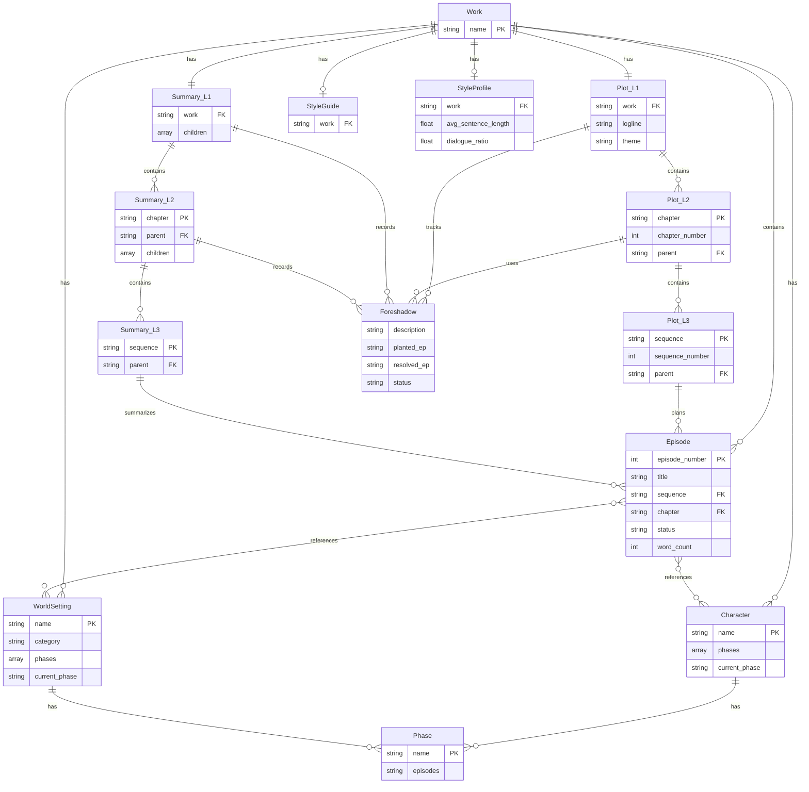

# Novel-Athanor データモデル解析レポート

**Phase**: 1.2 データモデル解析
**対象**: `vault/`, `templates/`
**日時**: 2026-01-24

---

## 1. エンティティ概要

### 1.1 エンティティ一覧

```
┌─────────────────────────────────────────────────────────────┐
│                    Entity Overview                          │
├─────────────────────────────────────────────────────────────┤
│ 作品データ                                                   │
│  ├─ Character (キャラクター)     ... フェーズ管理あり        │
│  ├─ WorldSetting (世界観設定)    ... フェーズ管理あり        │
│  ├─ Episode (エピソード)         ... 本文                   │
│  ├─ Plot (プロット)              ... L1/L2/L3 階層          │
│  ├─ Summary (サマリ)             ... L1/L2/L3 階層          │
│  ├─ StyleGuide (文体ガイド)      ... 定性                   │
│  └─ StyleProfile (文体プロファイル) ... 定量                 │
└─────────────────────────────────────────────────────────────┘
```

### 1.2 ストレージ形式

| エンティティ | 形式 | メタデータ |
|-------------|------|-----------|
| すべて | Markdown (.md) | YAML frontmatter |

**特徴**:
- Obsidian互換の `[[リンク]]` 記法
- YAML frontmatterでメタデータ管理
- Markdownセクションで本文構造化

---

## 2. エンティティ詳細

### 2.1 Character（キャラクター）

**ファイルパス**: `vault/{作品名}/characters/{キャラ名}.md`

**YAML frontmatter**:
```yaml
type: character
name: "キャラクター名"
phases: []                    # フェーズ配列
current_phase: null           # 現在のフェーズ
created: YYYY-MM-DD
updated: YYYY-MM-DD
tags:
  - character
```

**Markdownセクション**:
- `## 現在の状態`: current_phase時点の状態（自動生成）
- `## フェーズ別記録`: 各フェーズの詳細（外見/性格/立場/能力/関係）
- `## 隠し設定`: **AIから参照されない秘匿情報**

**フェーズ管理**:
```yaml
phases:
  - name: "物語開始時"
    episodes: "1-10"
  - name: "覚醒後"
    episodes: "11-"
current_phase: "覚醒後"
```

---

### 2.2 WorldSetting（世界観設定）

**ファイルパス**: `vault/{作品名}/world/{category}/{設定名}.md`

**カテゴリ例**:
- `general/` - 世界観概要
- `locations/` - 場所
- `organizations/` - 組織
- `magic/` - 魔法体系
- `history/` - 歴史

**YAML frontmatter**:
```yaml
type: world_setting
name: "設定名"
category: "カテゴリ"
phases: []
current_phase: null
created: YYYY-MM-DD
updated: YYYY-MM-DD
tags:
  - world_setting
  - "カテゴリ"
```

**Markdownセクション**:
- `## 現在の状態`: current_phase時点の状態
- `## フェーズ別記録`: 概要/詳細/変化点
- `## 隠し設定`: 秘匿情報

---

### 2.3 Episode（エピソード）

**ファイルパス**: `vault/{作品名}/episodes/{ep_XXXX}.md`

**YAML frontmatter**:
```yaml
type: episode
work: "作品名"
episode_number: 1
title: "タイトル"
sequence: "シーケンス名"
chapter: "章名"
status: draft              # draft / complete / published
word_count: 0
created: YYYY-MM-DD
updated: YYYY-MM-DD
tags:
  - episode
  - "作品名"
```

**Markdownセクション**:
- `## メタ情報`: シーケンス、章、ステータス
- `## 登場キャラクター`: `[[キャラ名]]` リンク
- `## 登場設定`: `[[場所名]]` リンク
- `## 本文`: エピソード本文
- `## 執筆メモ`: 作者用メモ

---

### 2.4 Plot（プロット）- L1/L2/L3 階層

**設計図**：物語の計画・構想

#### L1: 全体プロット
**ファイルパス**: `vault/{作品名}/_plot/L1_overall.md`

```yaml
type: plot
level: L1
work: "作品名"
```

**セクション**:
- ログライン（1文要約）
- テーマ
- 三幕構成（発端/葛藤/解決）
- キャラクターアーク
- **伏線マスターリスト** ⭐
- 章構成（→L2へのリンク）

#### L2: 章プロット
**ファイルパス**: `vault/{作品名}/_plot/L2_chapters/{章番号}_{章名}.md`

```yaml
type: plot
level: L2
chapter: "章名"
chapter_number: 1
parent: "[[L1_overall]]"
episodes: [1-10]
```

**セクション**:
- 章の目的
- 開始/終了状態
- 主要イベント
- **伏線（張る/回収）** ⭐
- シーケンス構成（→L3へのリンク）

#### L3: シーケンスプロット
**ファイルパス**: `vault/{作品名}/_plot/L3_sequences/{章番号}_{章名}/seq_{番号}.md`

```yaml
type: plot
level: L3
sequence: "シーケンス名"
sequence_number: 1
parent: "[[L2_chapters/01_章名]]"
episodes: [1-3]
```

**セクション**:
- シーケンスの目的
- 場面リスト（ep/場面/POV/場所/登場キャラ）
- 状態変化
- 次シーケンスへの接続

---

### 2.5 Summary（サマリ）- L1/L2/L3 階層

**実績**：実際に書かれた内容の要約

#### L1: 全体サマリ
**ファイルパス**: `vault/{作品名}/_summary/L1_overall.md`

```yaml
type: summary
level: L1
work: "作品名"
children:
  - "[[L2_chapters/01_章名1]]"
episodes: [1-最新]
extracted_from: [L2_summaries | episodes]
```

**セクション**:
- 作品概要（500-800文字）
- 章別サマリ
- キャラクターアーク（実績）
- **伏線回収状況** ⭐
- 三幕構成（実績）

#### L2: 章サマリ
**ファイルパス**: `vault/{作品名}/_summary/L2_chapters/{章番号}_{章名}.md`

```yaml
type: summary
level: L2
chapter: "章名"
parent: "[[L1_overall]]"
children:
  - "[[L3_sequences/...]]"
episodes: [1-10]
extracted_from: [L3_summaries | episodes]
```

**セクション**:
- 章の概要（300-500文字）
- シーケンス一覧
- 状態変化（開始/終了）
- **伏線まとめ（張られた/回収された）** ⭐

#### L3: シーケンスサマリ
**ファイルパス**: `vault/{作品名}/_summary/L3_sequences/{章番号}_{章名}/seq_{番号}.md`

```yaml
type: summary
level: L3
sequence: "シーケンス名"
parent: "[[L2_chapters/01_章名]]"
episodes: [1-3]
extracted_from: [ep.1, ep.2, ep.3]
```

**セクション**:
- エピソード要約（各100-200文字）
- 状態変化
- 登場キャラクター/設定
- 重要イベント

---

### 2.6 StyleGuide（文体ガイド）

**ファイルパス**: `vault/{作品名}/_style_guides/style-guide.md`

**内容（定性分析）**:
- 文体の特徴
- 視点（一人称/三人称）
- 時制
- 会話文の書き方
- 描写の傾向
- 避けるべき表現

---

### 2.7 StyleProfile（文体プロファイル）

**ファイルパス**: `vault/{作品名}/_style_profiles/{作品名}.md`

**内容（定量分析）**:
- 平均文長
- 会話比率
- 語彙豊富度（TTR）
- 品詞比率
- 頻出語

---

## 3. ER図



---

## 4. 階層構造の詳細

### 4.1 Plot vs Summary の対比

```
┌─────────────────────────────────────────────────────────────┐
│              Plot（計画）    vs    Summary（実績）           │
├─────────────────────────────────────────────────────────────┤
│                                                             │
│  Plot L1 (全体計画)      ←→    Summary L1 (全体実績)       │
│     ↓                              ↓                        │
│  Plot L2 (章計画)        ←→    Summary L2 (章実績)         │
│     ↓                              ↓                        │
│  Plot L3 (シーケンス計画) ←→   Summary L3 (シーケンス実績)  │
│     ↓                              ↓                        │
│  [執筆予定]              →     Episode [実際の本文]         │
│                                                             │
├─────────────────────────────────────────────────────────────┤
│  用途:                                                      │
│  - Plot: 「こう書く予定」の設計図                            │
│  - Summary: 「こう書いた」の実績記録                         │
│  - 比較することで計画との乖離を検出                          │
└─────────────────────────────────────────────────────────────┘
```

### 4.2 データフロー

```
[執筆前]
  Plot L1 → Plot L2 → Plot L3 → 執筆ガイド
                                    ↓
[執筆]                          Episode
                                    ↓
[執筆後]
  Episode → Summary L3 → Summary L2 → Summary L1
                                    ↓
[比較]
  Plot L1 ←→ Summary L1 (乖離検出)
```

---

## 5. フェーズ管理システム

### 5.1 目的

キャラクターや世界観が物語の進行とともに変化することを追跡する。

### 5.2 実装

```yaml
# frontmatter 例
phases:
  - name: "物語開始時"
    episodes: "1-10"
    # この時点の状態は「フェーズ別記録」セクションに記載
  - name: "覚醒後"
    episodes: "11-"
current_phase: "覚醒後"
```

### 5.3 参照ルール

| シナリオ | 参照するフェーズ |
|---------|-----------------|
| 下書き生成 | `current_phase` のみ |
| 回想シーン | 過去フェーズを指定可能 |
| 整合性チェック | 全フェーズを参照 |

---

## 6. 隠し設定システム

### 6.1 目的

ネタバレや伏線の種明かしを、AIの下書き生成から除外する。

### 6.2 実装

```markdown
## 隠し設定

<!--
このセクション以下は /draft-scene から参照されない
-->

- 実は主人公の父親は...
- 最終話で明かされる真実...
```

### 6.3 情報階層

| 階層 | 参照元 | 用途 |
|-----|--------|-----|
| 通常設定 | AI下書き生成 | 一般的な設定 |
| `## 隠し設定` | 作者のみ | ネタバレ、伏線の種明かし |

---

## 7. 伏線管理の現状評価

### 7.1 実装状況

| 機能 | 評価 | 詳細 |
|-----|------|------|
| 伏線の定義構造 | ⚠️ 部分実装 | Plot/Summaryのテーブルで管理 |
| 発生追跡 | ⚠️ 部分実装 | `planted_ep` フィールド |
| 回収追跡 | ⚠️ 部分実装 | `resolved_ep` フィールド |
| ステータス管理 | ⚠️ 部分実装 | planned/active/resolved |
| 情報階層 | ✅ 実装済み | `## 隠し設定` |
| 整合性チェック | ❌ 未実装 | 伏線専用のチェックなし |
| 独立エンティティ | ❌ 未実装 | 専用ファイル構造なし |

### 7.2 現在の伏線管理方法

**Plot L1** の `## 伏線マスターリスト`:
```markdown
| 伏線 | 張る場所 | 回収場所 | ステータス |
|:--|:--|:--|:--|
| 主人公の出生 | ep.3 | ep.50 | planned |
```

**Plot L2** の `## 伏線`:
```markdown
### この章で張る伏線
| 伏線 | 該当 ep | 備考 |
|:--|:--|:--|
| 謎の手紙 | ep.5 | 第3章で回収予定 |

### この章で回収する伏線
| 伏線 | 該当 ep | 備考 |
|:--|:--|:--|
| 古い写真 | ep.12 | 第1章で張った |
```

### 7.3 課題と改善提案

```
┌─────────────────────────────────────────────────────────────┐
│ 課題                           │ 改善提案                    │
├─────────────────────────────────────────────────────────────┤
│ 伏線が複数ファイルに分散      │ 専用エンティティの追加       │
│ IDによる一意特定が困難        │ FS-XXX 形式のID付与          │
│ 伏線間の依存関係が不明確      │ 依存関係フィールドの追加     │
│ AIの伏線認識レベルが未定義    │ visibility属性の追加         │
│ 伏線の整合性チェック機能なし  │ 専用バリデーション機能       │
└─────────────────────────────────────────────────────────────┘
```

---

## 8. 新システムへの示唆

### 8.1 継承すべき設計パターン

| パターン | 説明 | 活用方法 |
|---------|------|---------|
| **YAML frontmatter** | 構造化メタデータ | そのまま採用 |
| **L1/L2/L3階層** | 粒度別の管理 | Plot/Summary両方で採用 |
| **フェーズ管理** | 時系列状態追跡 | Character/WorldSettingに適用 |
| **隠し設定** | 情報階層の実装 | `visibility`属性として汎用化 |
| **Obsidianリンク** | `[[]]`による相互参照 | そのまま採用 |
| **Plot vs Summary** | 計画と実績の分離 | 乖離検出に活用 |

### 8.2 拡張が必要な領域

| 領域 | 現状 | 拡張案 |
|-----|------|-------|
| 伏線管理 | テーブル形式 | 専用エンティティ（Foreshadow） |
| 情報階層 | 隠し設定のみ | 4段階visibility |
| 整合性チェック | 手動 | 自動バリデーション |
| 状態変化追跡 | フェーズ単位 | イベント単位も検討 |

---

## 9. 参照

- `docs/Novel-Athanor-main/vault/templates/`
- `docs/Novel-Athanor-main/CLAUDE.md`
- `docs/specs/novel-generator/analysis-novel-athanor-architecture.md`
