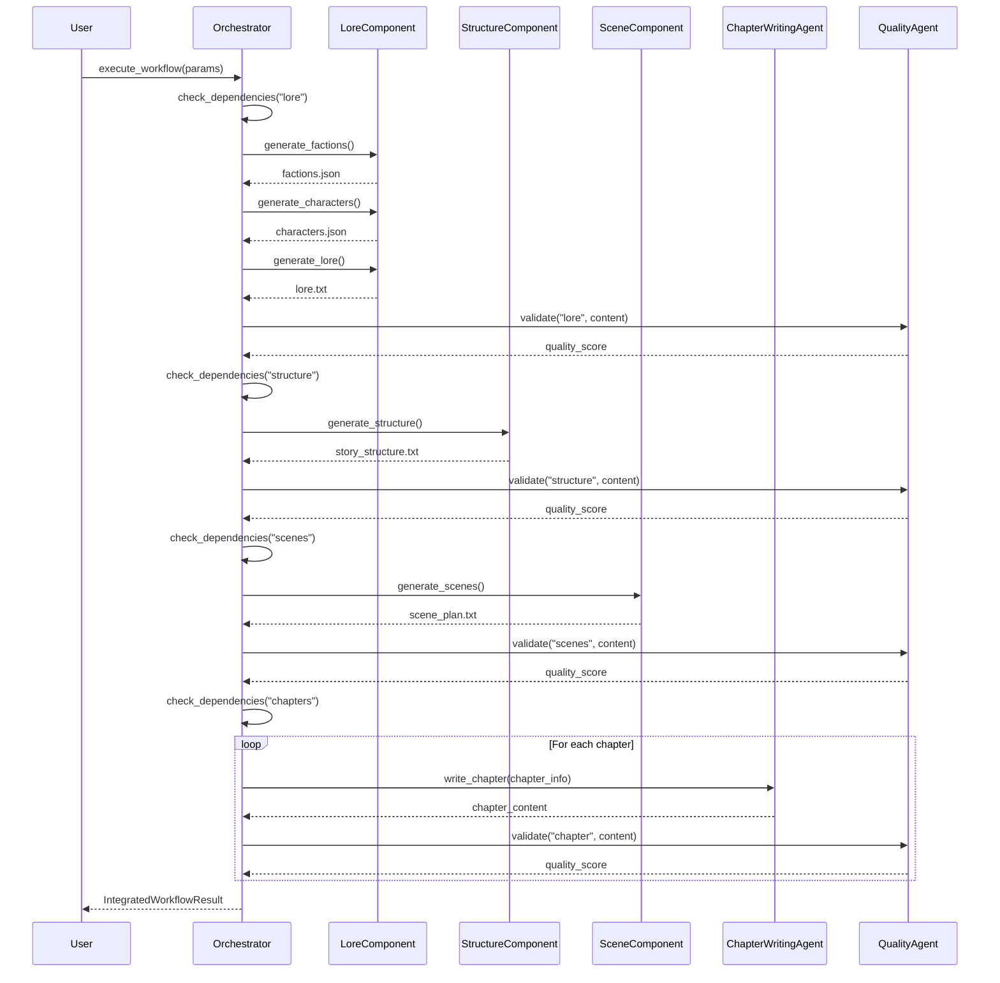

# NovelWriter 解析レポート: アーキテクチャ編

**Phase 2.1**: エージェントアーキテクチャ分析
**解析日**: 2026-01-24
**対象**: `docs/NovelWriter-main/`

---

## 1. システム概要

NovelWriterは**全自動小説生成システム**で、マルチエージェントアーキテクチャによりLore生成からChapter執筆までを自動化する。

### 1.1 設計思想

| 観点 | NovelWriter | Novel-Athanor |
|------|-------------|---------------|
| **自動化レベル** | 全自動・バッチ処理志向 | 対話的・人間介入重視 |
| **ワークフロー** | 線形依存・強制順序 | 柔軟・任意順序 |
| **品質管理** | 自動スコアリング＆リトライ | 人間レビュー中心 |
| **LLM統合** | マルチプロバイダー・マルチモデル | Claude特化 |
| **ターゲット** | ゼロからの一括生成 | 既存作品の管理・執筆支援 |

### 1.2 技術スタック

```
Python 3.x
├── GUI: Tkinter
├── LLM: OpenAI, Anthropic, Google Gemini
├── データ: JSON, Markdown, Plain Text
└── アーキテクチャ: Multi-Agent System
```

---

## 2. エージェントアーキテクチャ

### 2.1 エージェント階層

```
                    ┌─────────────────────────┐
                    │ IntegratedStoryOrchestrator │
                    │  (ワークフロー統括)          │
                    └───────────┬─────────────┘
                                │
        ┌───────────┬───────────┼───────────┬───────────┐
        ▼           ▼           ▼           ▼           ▼
┌─────────────┐ ┌─────────────┐ ┌─────────────┐ ┌─────────────┐ ┌─────────────┐
│ QualityCtrl │ │ Consistency │ │ ChapterWrite│ │  Review &   │ │ Adaptive    │
│   Agent     │ │   Agent     │ │   Agent     │ │ Retry Agent │ │ Planning    │
└─────────────┘ └─────────────┘ └─────────────┘ └─────────────┘ └─────────────┘
```

### 2.2 BaseAgent インターフェース

```python
class BaseAgent(ABC):
    """全エージェントの基底クラス"""

    def __init__(self, name: str, model: Optional[str] = None):
        self.name = name
        self.model = model or get_model()
        self.available_tools = []

    @abstractmethod
    def get_available_tools(self) -> List[str]: ...

    @abstractmethod
    def process_task(self, task_data: Dict[str, Any]) -> AgentResult: ...

    @abstractmethod
    def get_required_fields(self) -> List[str]: ...
```

### 2.3 各エージェントの責務

| エージェント | 責務 | 主要ツール |
|-------------|------|-----------|
| **IntegratedStoryOrchestrator** | ワークフロー全体の統括・依存関係管理 | execute_workflow, validate_step |
| **QualityControlAgent** | 品質評価・改善提案 | analyze_coherence, analyze_pacing, evaluate_prose |
| **ConsistencyAgent** | キャラクター/世界観/プロットの整合性追跡 | track_character, validate_consistency |
| **ChapterWritingAgent** | 章の自動生成・バッチ処理 | write_chapter, write_batch |
| **ReviewAndRetryAgent** | 生成コンテンツのレビュー・リトライ判定 | review_step_output, assess_quality |
| **AdaptivePlanningAgent** | ストーリーアーク分析・調整提案 | analyze_story_arc, propose_adjustments |

---

## 3. ワークフローシステム

### 3.1 ワークフローステップ

```
Parameters → Lore → Structure → Scenes → Chapters
```

### 3.2 依存関係定義

```python
step_dependencies = {
    "lore": ["parameters"],
    "structure": ["parameters", "lore"],
    "scenes": ["parameters", "lore", "structure"],
    "chapters": ["parameters", "lore", "structure", "scenes"]
}
```

### 3.3 ワークフロー実行フロー



---

## 4. 品質管理システム

### 4.1 3段階レビューアーキテクチャ

```
Scene Review → Chapter Review → Batch Review
```

### 4.2 レビューデータ構造

```python
@dataclass
class SceneReview:
    scene_number: int
    chapter_number: int
    quality_score: float      # 0.0 - 1.0
    word_count: int
    issues: List[str]
    strengths: List[str]
    suggestions: List[str]
    confidence: float

@dataclass
class ChapterReview:
    chapter_number: int
    section_name: str
    overall_quality: float
    scene_reviews: List[SceneReview]
    coherence_score: float
    pacing_score: float
    character_development_score: float
    # ...

@dataclass
class BatchReview:
    batch_number: int
    chapter_reviews: List[ChapterReview]
    consistency_score: float
    progression_score: float
    style_consistency_score: float
    # ...
```

### 4.3 品質閾値設定

```python
@dataclass
class QualityThresholds:
    minimum_scene_quality: float = 0.6
    minimum_chapter_quality: float = 0.65
    minimum_batch_quality: float = 0.7
    coherence_threshold: float = 0.6
    pacing_threshold: float = 0.6
    character_development_threshold: float = 0.6
    consistency_threshold: float = 0.7
    progression_threshold: float = 0.6
    style_consistency_threshold: float = 0.65
    retry_below_threshold: bool = True
    max_retries: int = 2
```

### 4.4 品質分析指標

| 指標 | 説明 | 評価方法 |
|-----|------|---------|
| **Coherence Score** | シーン間の一貫性 | シーン長の分散、遷移品質 |
| **Pacing Score** | ペーシングの適切さ | シーン長バリエーション、緩急 |
| **Prose Score** | 文章品質 | 語彙多様性、文構造 |
| **Character Development** | キャラクター成長 | 対話量、内面描写、行動決定 |
| **Consistency Score** | バッチ間整合性 | 品質分散、スタイル一貫性 |
| **Progression Score** | ストーリー進行 | 章順序、セクション多様性 |

---

## 5. LLM統合層

### 5.1 マルチプロバイダー対応

```python
_model_config = {
    # OpenAI
    "gpt-4o": lambda prompt: send_prompt_openai(...),
    "o3": lambda prompt: send_prompt_openai_reasoning(...),
    "o4-mini": lambda prompt: send_prompt_openai_reasoning(...),
    "gpt-5-2025-08-07": lambda prompt: send_prompt_openai_reasoning(...),

    # Google Gemini
    "gemini-2.5-pro-exp-03-25": lambda prompt: send_prompt_gemini(...),
    "gemini-3-pro-preview": lambda prompt: send_prompt_gemini(...),

    # Anthropic Claude
    "claude-4-5-sonnet": lambda prompt: send_prompt_claude(...),
    "claude-4-5-opus": lambda prompt: send_prompt_claude(...),
}
```

### 5.2 バックエンド切り替え

```python
def set_backend(backend: str, model: Optional[str] = None):
    """
    backend: "api" | "codex" | "gemini-cli" | "claude-cli"
    """
    initialize_llm(backend=backend, model=model)
```

### 5.3 リトライ機構

```python
def send_prompt_with_retry(prompt, model=None, max_retries=3):
    for attempt in range(max_retries):
        try:
            return send_prompt(prompt, model=model)
        except Exception as e:
            if attempt < max_retries - 1:
                continue
    raise RuntimeError(f"Failed after {max_retries} attempts")
```

---

## 6. ジャンル設定システム

### 6.1 対応ジャンル

| ジャンル | サブジャンル例 |
|---------|--------------|
| Fantasy | High Fantasy, Dark Fantasy, Urban Fantasy, Sword and Sorcery, Mythic Fantasy, Fairy Tale |
| Sci-Fi | Space Opera, Cyberpunk, Hard Sci-Fi, etc. |
| Horror | Gothic Horror, Psychological Horror, etc. |
| Mystery | Detective, Cozy Mystery, etc. |
| Romance | Contemporary, Historical, etc. |
| Thriller | Psychological, Action, etc. |
| Historical | Period Drama, Alt History, etc. |
| Western | Classic, Revisionist, etc. |

### 6.2 ジャンル設定構造

```python
class FantasyConfigs:
    CONFIGS = {
        "High Fantasy": {
            "implied_settings": {
                "magic_system": True,
                "medieval_setting": True,
                "mythical_creatures": True,
                "epic_scale": True
            },
            "protagonist_types": [
                "Chosen One", "Magic User", "Knight/Warrior",
                "Royal Heir", "Common Hero", "Prophesied One"
            ],
            "conflict_scales": [
                "Personal Quest", "Kingdom-wide", "World-saving",
                "Good vs Evil", "Political Intrigue"
            ],
            "tones": [
                "Epic", "Heroic", "Noble", "Mythic", "Adventure"
            ]
        },
        # ...
    }
```

---

## 7. 整合性追跡システム

### 7.1 追跡対象エンティティ

```python
@dataclass
class CharacterState:
    name: str
    traits: List[str]
    relationships: Dict[str, str]
    location: str
    status: str
    first_appearance: int
    last_appearance: int

@dataclass
class WorldElement:
    name: str
    category: str  # "location", "item", "concept"
    description: str
    related_characters: List[str]
    first_mention: int

@dataclass
class PlotThread:
    name: str
    status: str  # "active", "resolved", "abandoned"
    involved_characters: List[str]
    key_events: List[str]
    introduced_in: int
    resolved_in: Optional[int]
```

### 7.2 整合性チェック機能

- キャラクター状態の追跡
- 世界観要素の管理
- プロットスレッドの追跡
- 矛盾検出

---

## 8. ディレクトリ構造

```
NovelWriter-main/
├── agents/
│   ├── base/
│   │   ├── agent.py              # BaseAgent, AgentResult
│   │   └── tool.py               # ToolRegistry
│   ├── consistency/
│   │   ├── consistency_agent.py  # ConsistencyAgent
│   │   └── consistency_tools.py
│   ├── orchestration/
│   │   ├── integrated_story_orchestrator.py
│   │   ├── story_generation_orchestrator.py
│   │   └── checkpoint_state.py
│   ├── quality/
│   │   ├── quality_agent.py      # QualityControlAgent
│   │   └── quality_tools.py
│   ├── review/
│   │   └── review_agent.py       # ReviewAndRetryAgent
│   ├── writing/
│   │   └── chapter_writing_agent.py
│   └── adaptive_planning_agent.py
├── core/
│   ├── config/
│   │   ├── genre_configs/        # ジャンル別設定
│   │   │   ├── fantasy.py
│   │   │   ├── scifi.py
│   │   │   └── ...
│   │   └── directory_config.py
│   ├── generation/
│   │   ├── ai_helper.py          # LLM統合層
│   │   ├── llm_interface/        # マルチプロバイダーLLM
│   │   └── helper_fns.py
│   └── gui/
│       ├── app.py                # メインアプリ
│       ├── lore.py               # Lore生成GUI
│       ├── story_structure.py    # 構造生成GUI
│       ├── scene_plan.py         # シーン計画GUI
│       └── chapter_writing.py    # 章執筆GUI
└── Generators/                   # プロンプトテンプレート
```

---

## 9. 新システムへの示唆

### 9.1 採用すべき要素

1. **エージェント分離アーキテクチャ**: 責務明確化
2. **品質スコアリングシステム**: 定量的品質評価
3. **マルチレベルレビュー**: Scene → Chapter → Batch
4. **整合性追跡**: Character/World/PlotThread管理
5. **ジャンル設定構造**: implied_settings, protagonist_types等

### 9.2 改善すべき点

1. **全自動志向の緩和**: 人間介入ポイントの追加
2. **伏線管理の欠如**: PlotThreadは追跡するが伏線の「張り」「回収」概念なし
3. **AI情報制御の欠如**: 設定のAI可視性制御なし
4. **L1/L2/L3階層の欠如**: フラットな構造計画

### 9.3 Novel-Athanorとの統合ポイント

| 機能 | Novel-Athanor | NovelWriter | 統合方針 |
|-----|--------------|-------------|---------|
| 品質管理 | 人間レビュー | 自動スコア | ハイブリッド |
| 整合性 | 部分的 | 追跡システム | NovelWriter採用 |
| 伏線管理 | 部分的 | なし | 新規設計 |
| AI制御 | 隠し設定 | なし | 新規設計（拡張） |
| ワークフロー | 柔軟 | 固定 | 柔軟＋依存管理 |

---

## 10. 次のステップ

- **Phase 2.2**: 生成ロジック詳細分析（プロンプト設計、テンプレート）
- **Phase 2.3**: 品質管理詳細分析（スコアリングアルゴリズム）
- **Phase 3**: 302_novel_writing 解析
