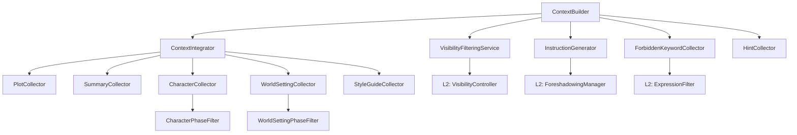

# L3-7-1b: build_context() 実装

## メタ情報

| 項目 | 値 |
|------|-----|
| ID | L3-7-1b |
| 優先度 | P1 |
| ステータス | done |
| 完了日 | 2026-02-04 |
| 依存タスク | L3-4-2a〜L3-4-2e, L3-4-3a |
| フェーズ | Phase F（ContextBuilder ファサード） |
| 参照仕様 | `docs/specs/novel-generator-v2/08_agent-design.md` Section 3 |

## 概要

ContextBuilder の `build_context()` メソッドを実装する。
全コレクターを統合し、FilteredContext を生成するメインメソッド。

## 受け入れ条件

- [ ] `ContextBuilder` クラスが実装されている
- [ ] `build_context()` メソッドが機能する
- [ ] 全コレクターとの統合
- [ ] 可視性フィルタリングとの統合
- [ ] エラーハンドリング（Graceful Degradation）
- [ ] ユニットテストが存在する

## 技術的詳細

### ファイル配置

- 実装: `src/core/context/context_builder.py`（新規）
- テスト: `tests/core/context/test_context_builder.py`（新規）

### クラス定義

```python
from dataclasses import dataclass, field
from pathlib import Path
from typing import Optional

from src.core.services.visibility_controller import VisibilityController
from src.core.services.foreshadowing_manager import ForeshadowingManager
from src.core.services.expression_filter import ExpressionFilter

from .scene_identifier import SceneIdentifier
from .filtered_context import FilteredContext
from .visibility_context import VisibilityAwareContext
from .foreshadow_instruction import ForeshadowInstructions
from .lazy_loader import FileLazyLoader
from .collectors.plot_collector import PlotCollector
from .collectors.summary_collector import SummaryCollector
from .collectors.character_collector import CharacterCollector
from .collectors.world_setting_collector import WorldSettingCollector
from .collectors.style_guide_collector import StyleGuideCollector
from .context_integrator import ContextIntegratorImpl
from .visibility_filtering import VisibilityFilteringService
from .foreshadowing_identifier import ForeshadowingIdentifier
from .instruction_generator import InstructionGeneratorImpl
from .forbidden_keyword_collector import ForbiddenKeywordCollector
from .hint_collector import HintCollector
from .scene_resolver import SceneResolver
from .phase_filter import CharacterPhaseFilter, WorldSettingPhaseFilter


@dataclass
class ContextBuilderConfig:
    """ContextBuilder の設定

    Attributes:
        vault_root: vault ルートパス
        enable_visibility_filter: 可視性フィルタを有効化
        enable_foreshadowing: 伏線システムを有効化
        max_characters: 最大キャラクター数
        max_world_settings: 最大世界観設定数
        phase_order: フェーズ順序リスト
    """
    vault_root: Path
    enable_visibility_filter: bool = True
    enable_foreshadowing: bool = True
    max_characters: int = 10
    max_world_settings: int = 20
    phase_order: list[str] = field(
        default_factory=lambda: ["initial", "arc_1", "arc_2", "finale"]
    )


@dataclass
class BuildResult:
    """build_context() の結果

    Attributes:
        context: フィルタリング済みコンテキスト
        visibility_context: 可視性情報（有効時）
        instructions: 伏線指示書（有効時）
        forbidden_keywords: 禁止キーワード
        warnings: 警告メッセージ
    """
    context: FilteredContext
    visibility_context: Optional[VisibilityAwareContext] = None
    instructions: Optional[ForeshadowInstructions] = None
    forbidden_keywords: list[str] = field(default_factory=list)
    warnings: list[str] = field(default_factory=list)


class ContextBuilder:
    """コンテキストビルダー（ファサード）

    L3 レイヤーのメインエントリーポイント。
    全コンポーネントを統合し、Ghost Writer に渡すコンテキストを構築する。

    Attributes:
        config: ビルダー設定
        loader: 遅延読み込みローダー
        resolver: シーンリゾルバー
        integrator: コンテキスト統合器
        visibility_service: 可視性フィルタリング
        instruction_generator: 伏線指示生成
        forbidden_collector: 禁止キーワード収集
        hint_collector: ヒント収集
    """

    def __init__(
        self,
        config: ContextBuilderConfig,
        visibility_controller: Optional[VisibilityController] = None,
        foreshadowing_manager: Optional[ForeshadowingManager] = None,
        expression_filter: Optional[ExpressionFilter] = None,
    ):
        self.config = config
        self.visibility_controller = visibility_controller
        self.foreshadowing_manager = foreshadowing_manager
        self.expression_filter = expression_filter

        # 内部コンポーネント初期化
        self._init_components()

    def _init_components(self) -> None:
        """内部コンポーネントを初期化"""
        vault = self.config.vault_root

        # 基本コンポーネント
        self.loader = FileLazyLoader(vault)
        self.resolver = SceneResolver(vault)

        # フェーズフィルター
        self.character_phase_filter = CharacterPhaseFilter(
            self.config.phase_order
        )
        self.world_phase_filter = WorldSettingPhaseFilter(
            self.config.phase_order
        )

        # コレクター
        self.plot_collector = PlotCollector(vault, self.loader)
        self.summary_collector = SummaryCollector(vault, self.loader)
        self.character_collector = CharacterCollector(
            vault,
            self.loader,
            self.resolver,
            self.character_phase_filter,
        )
        self.world_collector = WorldSettingCollector(
            vault,
            self.loader,
            self.resolver,
            self.world_phase_filter,
        )
        self.style_collector = StyleGuideCollector(vault, self.loader)

        # 統合器
        self.integrator = ContextIntegratorImpl(
            vault_root=vault,
            loader=self.loader,
            resolver=self.resolver,
        )

        # 可視性サービス（有効な場合）
        if self.config.enable_visibility_filter and self.visibility_controller:
            self.visibility_service = VisibilityFilteringService(
                self.visibility_controller
            )
        else:
            self.visibility_service = None

        # 伏線サービス（有効な場合）
        if self.config.enable_foreshadowing and self.foreshadowing_manager:
            self.identifier = ForeshadowingIdentifier(
                self.foreshadowing_manager
            )
            self.instruction_generator = InstructionGeneratorImpl(
                self.foreshadowing_manager,
                self.identifier,
            )
            self.forbidden_collector = ForbiddenKeywordCollector(
                vault,
                self.loader,
                self.expression_filter,
            )
        else:
            self.identifier = None
            self.instruction_generator = None
            self.forbidden_collector = None

        # ヒント収集
        self.hint_collector = HintCollector()

    def build_context(
        self,
        scene: SceneIdentifier,
    ) -> BuildResult:
        """コンテキストを構築

        メインのビルドメソッド。シーン識別子から
        Ghost Writer に渡す完全なコンテキストを生成する。

        Args:
            scene: シーン識別子

        Returns:
            構築結果
        """
        warnings = []

        # 1. 基本コンテキスト統合
        base_context, collect_warnings = self.integrator.integrate_with_warnings(
            scene,
            plot_collector=self.plot_collector,
            summary_collector=self.summary_collector,
            character_collector=self.character_collector,
            world_collector=self.world_collector,
            style_collector=self.style_collector,
        )
        warnings.extend(collect_warnings)

        # 2. 伏線指示書生成
        instructions = None
        forbidden_keywords = []

        if self.instruction_generator:
            try:
                instructions = self.instruction_generator.generate(scene)
            except Exception as e:
                warnings.append(f"伏線指示生成エラー: {e}")
                instructions = ForeshadowInstructions()

        # 3. 禁止キーワード収集
        if self.forbidden_collector:
            try:
                forbidden_result = self.forbidden_collector.collect(
                    scene, instructions
                )
                forbidden_keywords = forbidden_result.keywords
            except Exception as e:
                warnings.append(f"禁止キーワード収集エラー: {e}")

        # 4. 可視性フィルタリング
        visibility_context = None

        if self.visibility_service:
            try:
                visibility_context = self.visibility_service.filter_context(
                    base_context
                )
                # フィルタリング結果で base_context を更新
                if visibility_context.filtered_characters:
                    base_context.characters = visibility_context.filtered_characters
                if visibility_context.filtered_world_settings:
                    base_context.world_settings = visibility_context.filtered_world_settings
            except Exception as e:
                warnings.append(f"可視性フィルタリングエラー: {e}")

        return BuildResult(
            context=base_context,
            visibility_context=visibility_context,
            instructions=instructions,
            forbidden_keywords=forbidden_keywords,
            warnings=warnings,
        )

    def build_context_simple(
        self,
        scene: SceneIdentifier,
    ) -> FilteredContext:
        """シンプル版: FilteredContext のみ返す

        warnings を無視し、コンテキストのみが必要な場合に使用。

        Args:
            scene: シーン識別子

        Returns:
            フィルタリング済みコンテキスト
        """
        result = self.build_context(scene)
        return result.context
```

### 依存関係図



### テストケース

| No. | テストケース | 内容 |
|-----|-------------|------|
| 1 | build_context() 正常 | 全コンポーネント統合 |
| 2 | build_context() 可視性なし | フィルタリングスキップ |
| 3 | build_context() 伏線なし | 指示書生成スキップ |
| 4 | build_context() エラー時 | Graceful Degradation |
| 5 | build_context_simple() | シンプル版 |
| 6 | _init_components() | 初期化確認 |
| 7 | BuildResult 構造 | 全フィールド設定 |
| 8 | warnings 収集 | 警告伝搬 |

### エラーハンドリング

```python
# 各コンポーネントのエラーは警告として記録し、処理を継続
try:
    instructions = self.instruction_generator.generate(scene)
except Exception as e:
    warnings.append(f"伏線指示生成エラー: {e}")
    instructions = ForeshadowInstructions()  # 空の指示書で継続
```

## 変更履歴

| 日付 | 変更内容 |
|------|---------|
| 2026-01-26 | 初版作成 |
