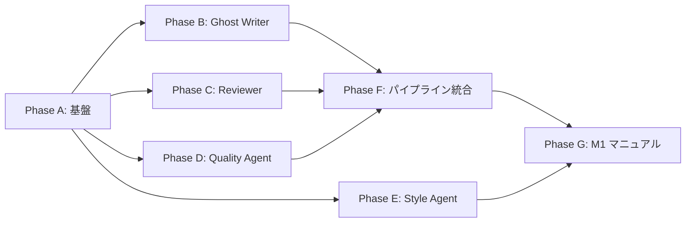

# L4-L5-M1 Phase分割・タスクリスト

**作成日**: 2026-02-05
**フェーズ**: PLANNING (tasks)
**設計書参照**: `docs/memos/2026-02-05-l4-core-design.md`

---

## 概要

L4 Agent Layer + L5 簡易パイプライン + M1 マニュアルを Phase A〜G に分割する。
各 Phase は独立したBUILDINGサイクル（TDD）で実装する。

### MVP Agent 構成

| Agent | Phase |
|-------|:-----:|
| Ghost Writer | B |
| Reviewer | C |
| Quality Agent | D |
| Style Agent | E |

### 依存関係

> Phase B/C/D/E は互いに独立だが、セッション的には直列で実装。
> Phase E (Style Agent) は /draft-scene パイプラインに直接不要なため、F の後でも可。

---

## Phase A: エージェント基盤

**目的**: L4 Python コアの骨格。全エージェントが依存する型定義・設定・CLI ツール基盤。

| ID | タスク | 優先度 | 成果物 |
|----|--------|:------:|--------|
| A-1 | Agent I/O モデル定義 | P1 | `src/agents/models/` (SceneRequirements, ReviewResult, QualityResult, PipelineConfig 等) |
| A-2 | パイプライン設定 | P1 | `src/agents/config.py` (MAX_REVIEW_RETRIES, QUALITY_THRESHOLDS 等) |
| A-3 | CLI エントリポイント | P1 | `src/agents/tools/cli.py` (argparse, サブコマンドルーティング) |
| A-4 | Context Tool | P1 | `src/agents/tools/context_tool.py` (build-context, format-context) |
| A-5 | `__init__.py` 整備 | P1 | `src/agents/__init__.py`, `src/agents/models/__init__.py` 等 |
| A-6 | Phase A テスト | P1 | `tests/agents/test_models.py`, `tests/agents/test_tools/test_context_tool.py` |

**タスク数**: 6
**見積り**: 1セッション

---

## Phase B: Ghost Writer

**目的**: テキスト生成エージェント。コンテキスト→プロンプト変換 + Claude Code agent 定義。

| ID | タスク | 優先度 | 成果物 |
|----|--------|:------:|--------|
| B-1 | Writing Prompt Formatter | P1 | `src/agents/prompts/ghost_writer.py` (format_writing_context()) |
| B-2 | Formatter スナップショットテスト | P1 | `tests/agents/test_prompts/test_ghost_writer_formatter.py` |
| B-3 | Ghost Writer agent 定義 | P1 | `.claude/agents/ghost-writer.md` |
| B-4 | 手動統合テスト | P1 | テスト vault で agent spawn → ドラフト生成を確認 |

**タスク数**: 4
**見積り**: 1セッション

---

## Phase C: Reviewer

**目的**: レビューエージェント。アルゴリズミックチェック + LLMレビュー + Human Fallback。

| ID | タスク | 優先度 | 成果物 |
|----|--------|:------:|--------|
| C-1 | Review Prompt Formatter | P1 | `src/agents/prompts/reviewer.py` (format_review_context()) |
| C-2 | Review Result Parser | P1 | `src/agents/parsers/review_parser.py` (parse_review_output()) |
| C-3 | Algorithmic Review Tool | P1 | `src/agents/tools/review_tool.py` (check-review CLI サブコマンド) |
| C-4 | Human Fallback ロジック | P1 | リトライカウント管理、閾値判定（config.py に統合 or 独立モジュール） |
| C-5 | Reviewer agent 定義 | P1 | `.claude/agents/reviewer.md` |
| C-6 | Parser + Tool テスト | P1 | `tests/agents/test_parsers/test_review_parser.py`, `tests/agents/test_tools/test_review_tool.py` |

**タスク数**: 6
**見積り**: 1セッション

---

## Phase D: Quality Agent

**目的**: 品質評価エージェント。スコアリング + 改善提案。

| ID | タスク | 優先度 | 成果物 |
|----|--------|:------:|--------|
| D-1 | Quality Prompt Formatter | P1 | `src/agents/prompts/quality.py` (format_quality_context()) |
| D-2 | Quality Result Parser | P1 | `src/agents/parsers/quality_parser.py` (parse_quality_output()) |
| D-3 | Quality Agent 定義 | P1 | `.claude/agents/quality-agent.md` |
| D-4 | Parser テスト | P1 | `tests/agents/test_parsers/test_quality_parser.py` |

**タスク数**: 4
**見積り**: 1セッション

---

## Phase E: Style Agent

**目的**: 文体分析エージェント。既存テキスト → StyleGuide/Profile 自動生成。

| ID | タスク | 優先度 | 成果物 |
|----|--------|:------:|--------|
| E-1 | Style Analysis Formatter | P1 | `src/agents/prompts/style_agent.py` (format_style_analysis_context()) |
| E-2 | Style Result Parser | P1 | `src/agents/parsers/style_parser.py` (parse_style_guide/profile_output()) |
| E-3 | Style CLI Tool | P1 | `src/agents/tools/style_tool.py` (analyze-style, save-style サブコマンド) |
| E-4 | 定量分析ユーティリティ | P1 | `src/agents/tools/text_stats.py` (平均文長, 会話比率, TTR, 頻出語) |
| E-5 | Style Agent 定義 | P1 | `.claude/agents/style-agent.md` |
| E-6 | /analyze-style コマンド | P1 | `.claude/commands/analyze-style.md` |
| E-7 | Parser + Tool テスト | P1 | `tests/agents/test_parsers/test_style_parser.py`, `tests/agents/test_tools/test_style_tool.py` |

**タスク数**: 7
**見積り**: 1〜2セッション

---

## Phase F: パイプライン統合 (L5 簡易版)

**目的**: /draft-scene コマンドで全パイプラインを一気通貫で実行。

| ID | タスク | 優先度 | 成果物 |
|----|--------|:------:|--------|
| F-1 | /draft-scene コマンド | P1 | `.claude/commands/draft-scene.md` |
| F-2 | テスト vault 作成 | P1 | `tests/fixtures/test_vault/` (エピソード、キャラ、プロット等の最小構成) |
| F-3 | E2E 統合テスト手順書 | P1 | `docs/memos/l4-e2e-test-plan.md` |
| F-4 | パイプラインデバッグ・調整 | P1 | agent MD / prompt formatter の調整 |

**タスク数**: 4
**見積り**: 1〜2セッション

---

## Phase G: M1 運用マニュアル

**目的**: 7シナリオのユーザーガイド。操作手順が確定した後に執筆。

| ID | タスク | 優先度 | 成果物 |
|----|--------|:------:|--------|
| G-1 | M1-1: 新作開始ガイド | P1 | `docs/presentations/getting-started/` |
| G-2 | M1-2: 毎エピソード作成フロー | P1 | `docs/presentations/workflow-guide/` (拡充) |
| G-3 | M1-3: L1設定変更ガイド | P1 | `docs/presentations/settings-guide/` |
| G-4 | M1-4: キャラ・世界観設定変更 | P1 | `docs/presentations/entity-guide/` |
| G-5 | M1-5: 伏線運用ガイド | P1 | `docs/presentations/foreshadowing-guide/` |
| G-6 | M1-6: トラブルシューティング | P1 | `docs/presentations/troubleshooting/` |
| G-7 | M1-7: AI可視性設定ガイド | P1 | `docs/presentations/visibility-guide/` |

**タスク数**: 7
**見積り**: 2〜3セッション

---

## サマリ

| Phase | 内容 | タスク数 | 依存 |
|:-----:|------|:--------:|------|
| A | エージェント基盤 | 6 | L3 |
| B | Ghost Writer | 4 | A |
| C | Reviewer | 6 | A |
| D | Quality Agent | 4 | A |
| E | Style Agent | 7 | A |
| F | パイプライン統合 | 4 | B, C, D |
| G | M1 マニュアル | 7 | E, F |
| **合計** | | **38** | |

> D3 見積り (~30) より +8。Style Agent MVP昇格 (+7) と E2E テスト vault (+1) が増分。

---

## 変更履歴

| 日付 | 内容 |
|------|------|
| 2026-02-05 | 初版作成 |
